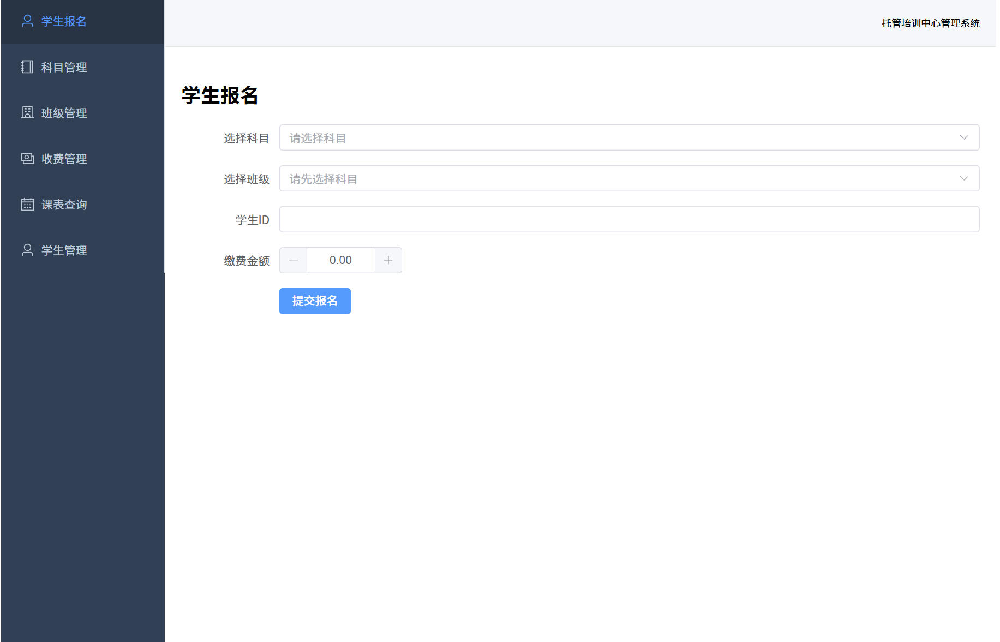

# 托管培训中心信息管理系统

数据库课程设计项目 | 前后端分离架构 | Spring Boot + Vue 3 + MySQL

---

## 一、项目简介

### 1.1 项目背景

某托管培训中心需要建立一套信息管理系统，替代原有的人工管理方式，对学生报名、科目维护、教室排课以及账目收费等日常业务进行统一的数字化管理。

### 1.2 核心业务需求

| 序号 | 业务模块 | 功能描述 |
|:----:|----------|----------|
| 1 | **学生报名** | 根据学生报名的科目查询班级信息；若满员则提示报名下期；未满员则选择教师（同科目不同教师收费不同），完成报名登记并开具收费清单 |
| 2 | **科目管理** | 维护科目基本信息（奥数、围棋、书法、口才等）；同一科目可由不同等级教师承担，收费标准与课时报酬因教师知名度而异 |
| 3 | **排课管理** | 为每个班级安排上课时间与教室，生成学生个人课表与教师授课日程表 |
| 4 | **账目管理** | 记录每笔缴费流水，支持开具收据、打印收费清单、催缴欠费查询 |

### 1.3 数据要求

- **学生信息**：学生编号、学生姓名、报名时间、交款额、所选科目（可能不止一门）
- **科目信息**：科目号、科目名、学时、上课周期、收费、上课地点、教师号、招收人数、已报名人数
- **教师信息**：教师号、教师名、教师等级、教师特长
- **账目信息**：日期、班级代号、学生编号、科目号、交款额

---

## 二、技术栈

| 技术/工具 | 类别 | 版本 | 作用 |
|-----------|------|------|------|
| Java | 后端语言 | JDK 17 (Temurin) | 编写业务逻辑：学生报名、收费计算、满员判断等 |
| Spring Boot | 后端框架 | 3.x | 快速搭建后端服务器，提供 REST API |
| MyBatis | ORM 框架 | 3.x | 后端与 MySQL 数据交互，注解 + Mapper 混合 |
| Maven | 构建工具 | 3.x | 依赖管理与项目构建 |
| Vue.js | 前端框架 | 3.x (Composition API) | 构建用户操作界面 |
| Vite | 前端构建 | 5.x | Vue 项目开发服务器与生产打包 |
| Vue Router | 前端路由 | 4.x | 单页面应用路由管理 |
| Axios | HTTP 库 | 最新 | 前后端数据通信 |
| Element Plus | UI 组件库 | 最新 | 表格、表单、弹窗、导航等 UI 组件 |
| Node.js | 前端运行环境 | v24.16.0 | Vue 项目运行与构建依赖 |
| npm | 包管理器 | 11.13.0 | 前端依赖安装与管理 |
| MySQL | 数据库 | 8.x | 持久化存储全部业务数据 |
| MySQL Workbench | 数据库工具 | — | 可视化管理、建表、调试 SQL |
| IntelliJ IDEA | 后端 IDE | — | Spring Boot 项目开发与调试 |
| VS Code | 前端编辑器 | — | Vue 项目开发 |
| Postman | 接口调试 | — | 独立测试后端 API |
| Git + GitHub | 版本控制 | — | 代码版本管理、每日提交、远程托管 |

---

## 三、系统架构

### 3.1 整体架构

```
浏览器 (Browser)  ─── http://localhost:5173 ───▶  前端 (Vue 3 + Element Plus)
                                                  ├─ Router  路由层
                                                  ├─ Views   视图层（6个页面组件）
                                                  └─ API     Axios 请求封装层

                                                     │  HTTP/JSON (CORS 跨域)
                                                     ▼
                                                 后端 (Spring Boot + MyBatis)
                                                  ├─ Controller  控制层（7个 REST 接口）
                                                  ├─ Service     业务逻辑层（事务管理/校验）
                                                  ├─ Mapper      数据访问层（6个）
                                                  └─ Entity      实体层（6个 Java Bean）

                                                     │  JDBC
                                                     ▼
                                                 MySQL 数据库 (tutoring_center)
                                                  ├─ teachers            教师信息表
                                                  ├─ subjects            科目基础表
                                                  ├─ classes             班级排课表
                                                  ├─ students            学生档案表
                                                  ├─ student_enrollments 选课报名桥接表
                                                  └─ accounts            账目流水表
```

### 3.2 后端分层架构

采用标准 MVC 四层架构：

| 层级 | 包路径 | 职责 |
|------|--------|------|
| **Entity** | `entity/` | 数据库表对应的 Java 实体类，纯数据载体 |
| **Mapper** | `mapper/` | 数据访问层，使用 MyBatis 注解执行 SQL |
| **Service** | `service/` | 业务逻辑层，核心算法、事务管理、数据校验 |
| **Controller** | `controller/` | 控制层，对外暴露 REST API，处理 HTTP 请求 |

### 3.3 前端分层架构

| 层级 | 路径 | 职责 |
|------|------|------|
| **Router** | `router/` | 路由配置，URL ↔ 页面组件映射 |
| **Layout** | `layouts/` | 全局布局（侧边栏 + 顶栏 + 内容区） |
| **Views** | `views/` | 6 个页面组件，对应各业务模块 |
| **API** | `api/` | 封装 Axios 请求，一个模块一个文件 |
| **Utils** | `utils/` | 全局工具（Axios 实例、拦截器） |

---

## 四、项目结构

```
DBACourseProject
│
├─ database/                          # 数据库脚本
│   ├─ create_table.sql               #   建表脚本（6 张表，含外键与约束）
│   └─ insert_test_data.sql           #   测试数据（4 教师 + 4 科目 + 8 班级 + 5 学生 + 7 报名 + 7 账目）
│
├─ backend/                           # 后端 Spring Boot 项目
│   └─ center-management/
│       ├─ pom.xml                    #   Maven 依赖配置
│       └─ src/main/
│           ├─ resources/
│           │   └─ application.properties   # 数据库连接、MyBatis 配置
│           └─ java/com/training/centermanagement/
│               ├─ CenterManagementApplication.java   # 启动类
│               ├─ config/
│               │   └─ WebConfig.java                # CORS 跨域配置
│               ├─ entity/               # 实体层（6 个）
│               │   ├─ Teacher.java
│               │   ├─ Subject.java
│               │   ├─ Classes.java
│               │   ├─ Student.java
│               │   ├─ StudentEnrollment.java
│               │   └─ Account.java
│               ├─ mapper/               # 数据访问层（6 个）
│               │   ├─ TeacherMapper.java
│               │   ├─ SubjectMapper.java
│               │   ├─ ClassesMapper.java
│               │   ├─ StudentMapper.java
│               │   ├─ StudentEnrollmentMapper.java
│               │   └─ AccountMapper.java
│               ├─ service/              # 业务逻辑层（7 个）
│               │   ├─ TeacherService.java
│               │   ├─ SubjectService.java
│               │   ├─ ClassesService.java
│               │   ├─ StudentService.java
│               │   ├─ StudentEnrollmentService.java
│               │   ├─ AccountService.java
│               │   └─ ScheduleService.java
│               └─ controller/           # 控制层（7 个）
│                   ├─ TeacherController.java
│                   ├─ SubjectController.java
│                   ├─ ClassesController.java
│                   ├─ StudentController.java
│                   ├─ StudentEnrollmentController.java
│                   ├─ AccountController.java
│                   └─ ScheduleController.java
│
├─ frontend/                           # 前端 Vue 3 项目
│   ├─ package.json                    #   依赖配置
│   ├─ vite.config.js                  #   Vite 构建配置
│   ├─ index.html                      #   入口 HTML
│   └─ src/
│       ├─ main.js                     #   应用入口
│       ├─ App.vue                     #   根组件
│       ├─ style.css                   #   全局样式
│       ├─ router/
│       │   └─ index.js                #   路由配置（6 个页面路由）
│       ├─ layouts/
│       │   └─ MainLayout.vue          #   主布局（侧边栏 + 顶栏 + 路由出口）
│       ├─ utils/
│       │   └─ request.js              #   Axios 全局封装
│       ├─ api/                        #   API 接口层（7 个模块）
│       │   ├─ teacher.js
│       │   ├─ subject.js
│       │   ├─ classes.js
│       │   ├─ student.js
│       │   ├─ enrollment.js
│       │   ├─ account.js
│       │   └─ schedule.js
│       └─ views/                      #   页面组件（6 个）
│           ├─ StudentEnrollment.vue   #     学生报名页
│           ├─ SubjectManage.vue       #     科目管理页
│           ├─ ClassManage.vue         #     班级管理页
│           ├─ FeeManage.vue           #     收费管理页
│           ├─ ScheduleQuery.vue       #     课表查询页
│           └─ StudentManage.vue       #     学生管理页
│
├─ log/                                # 开发日志
│   ├─ day01.md                        #   Day01：项目规划与环境搭建
│   ├─ day02.md                        #   Day02：数据库设计与 Spring Boot 搭建
│   ├─ day03.md                        #   Day03：后端核心开发与 API 调试
│   ├─ day04.md                        #   Day04：后端完善与前端全面开发
│   └─ Images/                         #   日志截图
│
└─ README.md                           # 项目说明文档（本文件）
```

---

## 五、数据库设计

### 5.1 E-R 模型

系统包含 6 个核心实体，实体间关系如下：


- **students** 与 **classes** 为多对多关系，通过 **student_enrollments** 桥接表分解为两个一对多
- **classes** 是核心枢纽：关联 subjects（科目）、teachers（教师），并承载排课、定价、名额等核心属性
- **accounts** 记录每笔独立缴费流水，与 student_enrollments 形成对账稽核闭环

### 5.2 表结构详情

#### 5.2.1 教师表 (teachers)

| 字段名 | 数据类型 | 约束 | 说明 |
|--------|----------|------|------|
| teacher_id | INT | PRIMARY KEY | 教师工号 |
| teacher_name | VARCHAR(50) | NOT NULL | 教师姓名 |
| teacher_level | VARCHAR(20) | — | 教师等级（金牌教师/高级教师/特级教师/中级教师） |
| specialty | VARCHAR(100) | — | 特长科目描述（如：奥数,围棋） |

#### 5.2.2 科目表 (subjects)

| 字段名 | 数据类型 | 约束 | 说明 |
|--------|----------|------|------|
| subject_id | INT | PRIMARY KEY | 科目编号 |
| subject_name | VARCHAR(50) | NOT NULL | 科目名称（如：奥数、围棋、书法、口才） |
| hours | INT | NOT NULL | 标准总学时 |

#### 5.2.3 班级排课表 (classes)

| 字段名 | 数据类型 | 约束 | 说明 |
|--------|----------|------|------|
| class_code | VARCHAR(20) | PRIMARY KEY | 班级代号（如：MATH-2026-01） |
| subject_id | INT | FOREIGN KEY → subjects | 所属科目 |
| teacher_id | INT | FOREIGN KEY → teachers | 任课教师 |
| term | VARCHAR(50) | NOT NULL | 开班期次（如：2026春季班） |
| period | VARCHAR(50) | — | 上课时间（如：每周六 09:00-11:00） |
| fee | DECIMAL(10,2) | NOT NULL | 该班学费（因教师等级而异） |
| location | VARCHAR(100) | — | 教室（如：A栋101） |
| capacity | INT | NOT NULL | 招收人数上限 |
| enrolled_count | INT | DEFAULT 0 | 当前已报名人数 |
| teacher_remuneration | DECIMAL(10,2) | NOT NULL | 教师课时报酬 |

**enrolled_count <= capacity** 通过 CHECK 约束在数据库底层保障。

#### 5.2.4 学生表 (students)

| 字段名 | 数据类型 | 约束 | 说明 |
|--------|----------|------|------|
| student_id | INT | PRIMARY KEY | 学生编号 |
| student_name | VARCHAR(50) | NOT NULL | 学生姓名 |
| registration_time | DATETIME | NOT NULL | 建档注册时间 |

#### 5.2.5 学生选课报名表 (student_enrollments)

| 字段名 | 数据类型 | 约束 | 说明 |
|--------|----------|------|------|
| student_id | INT | PRIMARY KEY (复合), FK → students | 学生编号 |
| class_code | VARCHAR(20) | PRIMARY KEY (复合), FK → classes | 班级代号 |
| enrollment_time | DATETIME | NOT NULL | 报名时间 |
| amount_paid | DECIMAL(10,2) | DEFAULT 0.00 | 累计已缴金额（反规范化字段） |

复合主键 **(student_id, class_code)** 天然防止同一学生重复报名同一班级。

#### 5.2.6 账目流水表 (accounts)

| 字段名 | 数据类型 | 约束 | 说明 |
|--------|----------|------|------|
| account_id | INT | PRIMARY KEY, AUTO_INCREMENT | 流水号 |
| account_date | DATE | NOT NULL | 交易日期 |
| class_code | VARCHAR(20) | FOREIGN KEY → classes | 班级代号 |
| student_id | INT | FOREIGN KEY → students | 学生编号 |
| subject_id | INT | FOREIGN KEY → subjects | 科目编号（冗余便于科目维度统计） |
| amount_paid | DECIMAL(10,2) | NOT NULL | 本次实缴金额 |

每条缴费生成一条不可逆流水记录，通过 **SUM(amount_paid)** 与 **student_enrollments.amount_paid** 进行错账稽核。

---

## 六、后端 API 文档

Base URL: http://localhost:8080/api

### 6.1 教师模块 — `/api/teachers`

| 方法 | 路径 | 说明 |
|------|------|------|
| GET | `/api/teachers` | 获取全部教师列表 |

### 6.2 科目模块 — `/api/subjects`

| 方法 | 路径 | 说明 |
|------|------|------|
| GET | `/api/subjects` | 获取全部科目 |
| GET | `/api/subjects/{subjectId}` | 按 ID 查询科目 |
| POST | `/api/subjects` | 新增科目（含 ID 重复校验） |
| PUT | `/api/subjects` | 更新科目 |
| DELETE | `/api/subjects/{subjectId}` | 删除科目（有关联班级时阻止） |

### 6.3 班级模块 — `/api/classes`

| 方法 | 路径 | 说明 |
|------|------|------|
| GET | `/api/classes` | 获取全部班级 |
| GET | `/api/classes/{classCode}` | 按代号查询班级 |
| GET | `/api/classes/by-subject?subjectId=` | 按科目 ID 查询班级列表 |
| POST | `/api/classes` | 新增班级（含外键校验与代号重复校验） |

### 6.4 学生模块 — `/api/students`

| 方法 | 路径 | 说明 |
|------|------|------|
| GET | `/api/students` | 获取全部学生 |
| POST | `/api/students` | 新增学生（含 ID 重复校验） |

### 6.5 报名模块 — `/api/enrollments`

| 方法 | 路径 | 说明 |
|------|------|------|
| POST | `/api/enrollments/submit` | 提交报名（核心事务接口） |

**报名流程**（`StudentEnrollmentService.processEnrollment`）：

1. 校验学生是否存在
2. 校验是否重复报名
3. 校验班级是否存在
4. 检查班级是否满员（`enrolled_count >= capacity`）
5. 原子性递增 `enrolled_count`（防超卖）
6. 写入 `student_enrollments` 桥接表
7. 写入 `accounts` 账目流水表
8. 以上操作在同一事务中，失败则全部回滚

### 6.6 账目模块 — `/api/accounts`

| 方法 | 路径 | 说明 |
|------|------|------|
| GET | `/api/accounts` | 查询全部流水记录 |
| POST | `/api/accounts/pay` | 单独缴费（校验报名 + 写入流水 + 更新已缴金额） |
| GET | `/api/accounts/invoice?studentId=&classCode=` | 打印收费清单（应缴/已缴/欠费 + 缴费明细） |
| GET | `/api/accounts/debtors` | 查询欠费学生列表 |

### 6.7 课表模块 — `/api/schedules`

| 方法 | 路径 | 说明 |
|------|------|------|
| GET | `/api/schedules/student/{studentId}` | 学生课表（该生所有班级的上课时间与教室） |
| GET | `/api/schedules/teacher/{teacherId}` | 教师课表（该教师所有排课信息） |

---

## 七、前端页面说明

### 7.1 导航结构



### 7.2 页面功能详情

| 页面 | 路由 | 核心功能 |
|------|------|----------|
| **学生报名** | `/enrollment` | 科目下拉选择 → 班级列表加载（含名额/费用展示）→ 填写学生 ID 和缴费金额 → 提交报名（含各种拦截提示） |
| **科目管理** | `/subjects` | 科目表格展示、新增科目弹窗、编辑科目弹窗、删除确认 |
| **班级管理** | `/classes` | 班级列表（含科目/教师名称映射）、新增班级弹窗（科目/教师下拉选择、全部字段录入） |
| **收费管理** | `/fee` | 四 Tab：流水记录、单独缴费、收费清单（应缴/已缴/欠费）、催费列表（红色高亮欠费） |
| **课表查询** | `/schedule` | 双 Tab：按学生 ID 查个人课表、按教师 ID 查授课日程 |
| **学生管理** | `/students` | 内联新增表单 + 学生列表 |

---

## 八、运行说明

### 8.1 环境要求

| 软件 | 最低版本 |
|------|----------|
| JDK | 17+ |
| Maven | 3.6+ |
| Node.js | 18+ |
| npm | 9+ |
| MySQL | 8.0+ |

### 8.2 数据库初始化

1. 启动 MySQL 服务
2. 使用 MySQL Workbench 或命令行执行：

```sql
-- 依次执行建表脚本
source database/create_table.sql;

-- 导入测试数据
source database/insert_test_data.sql;
```

### 8.3 后端启动

```bash
cd backend/center-management

# 首次运行需安装依赖
./mvnw install

# 启动 Spring Boot 应用
./mvnw spring-boot:run
```

后端启动后访问地址：`http://localhost:8080`

验证接口示例：`http://localhost:8080/api/teachers`

### 8.4 前端启动

```bash
cd frontend

# 首次运行需安装依赖
npm install

# 启动开发服务器
npm run dev
```

前端启动后访问地址：`http://localhost:5173`

### 8.5 配置说明

**数据库连接** — `backend/center-management/src/main/resources/application.properties`：

```properties
spring.datasource.url=jdbc:mysql://localhost:3306/tutoring_center
spring.datasource.username=<你的MySQL用户名>
spring.datasource.password=<你的MySQL密码>
spring.datasource.driver-class-name=com.mysql.cj.jdbc.Driver
mybatis.configuration.map-underscore-to-camel-case=true
```

**前端 API 地址** — `frontend/src/utils/request.js`：

```js
const request = axios.create({
  baseURL: 'http://localhost:8080/api',
  timeout: 15000,
})
```

---

## 九、需求完成度对照

| 课程设计要求 | 实现情况 | 对应模块 |
|-------------|----------|----------|
| 学生报名（满员检查→选教师→报名→清单） | ✅ 完整实现 | `StudentEnrollmentService.processEnrollment` |
| 科目维护（增删改查） | ✅ 完整实现 | `SubjectController` CRUD |
| 同一科目不同教师差异化收费 | ✅ 在 classes 表中定价 | `classes.fee` + `classes.teacher_remuneration` |
| 满员提示报名下期 | ✅ 满员拦截 + term 字段 | 报名返回"已满员"提示 |
| 安排教室及上课日程 | ✅ 完整实现 | `ScheduleController` 学生/教师课表 |
| 账目管理（入账/收据/清单/催费） | ✅ 完整实现 | `AccountController` 四功能 |
| 数据要求：学生信息 | ✅ | `students` + `student_enrollments` |
| 数据要求：科目信息 | ✅ | `subjects` + `classes` 联合承载 |
| 数据要求：教师信息 | ✅ | `teachers` |
| 数据要求：账目信息 | ✅ | `accounts` |
| 事务管理（加分项） | ✅ | `@Transactional` 报名 + 缴费 |

---

## 十、开发日志

| 日期 | 文档 | 主要内容 |
|------|------|----------|
| 2026.6.1 | [Day01](log/day01.md) | 项目规划、Git 仓库创建、技术选型、目录结构搭建 |
| 2026.6.3～6.4 | [Day02](log/day02.md) | ER 图设计、6 张表建表、范式优化讨论、Spring Boot 项目创建、第一个 API 测试 |
| 2026.6.5 | [Day03](log/day03.md) | 后端核心开发、报名事务流程、跨域配置、防重复校验、全部接口调试 |
| 2026.6.6 | [Day04](log/day04.md) | 后端完善（科目 CRUD + 课表 + 缴费/清单/催费）、前端全面开发（6 页面） |

---

## 十一、GitHub 仓库

🔗 [https://github.com/Tru0Gruanol/DBACourseProject](https://github.com/Tru0Gruanol/DBACourseProject)

---

*本项目为数据库课程设计项目，持续开发中。*
