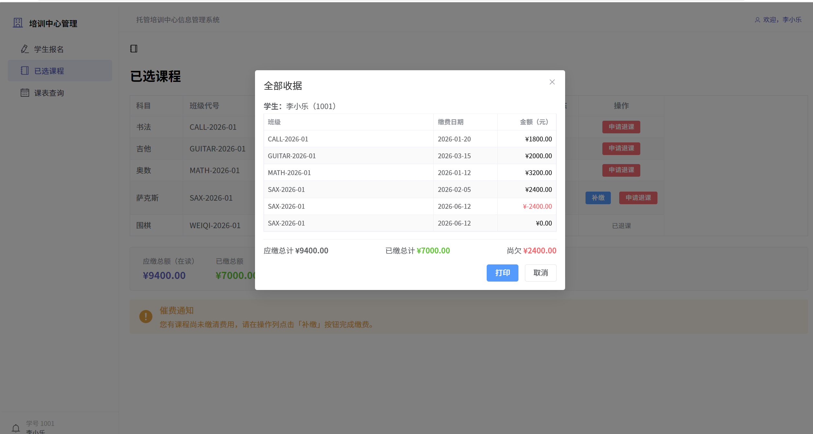
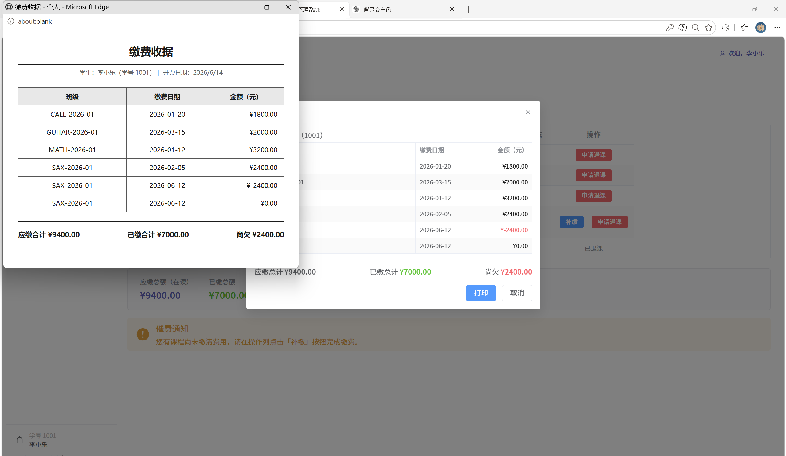
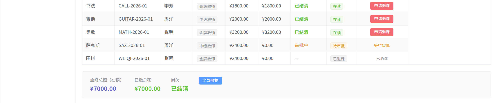
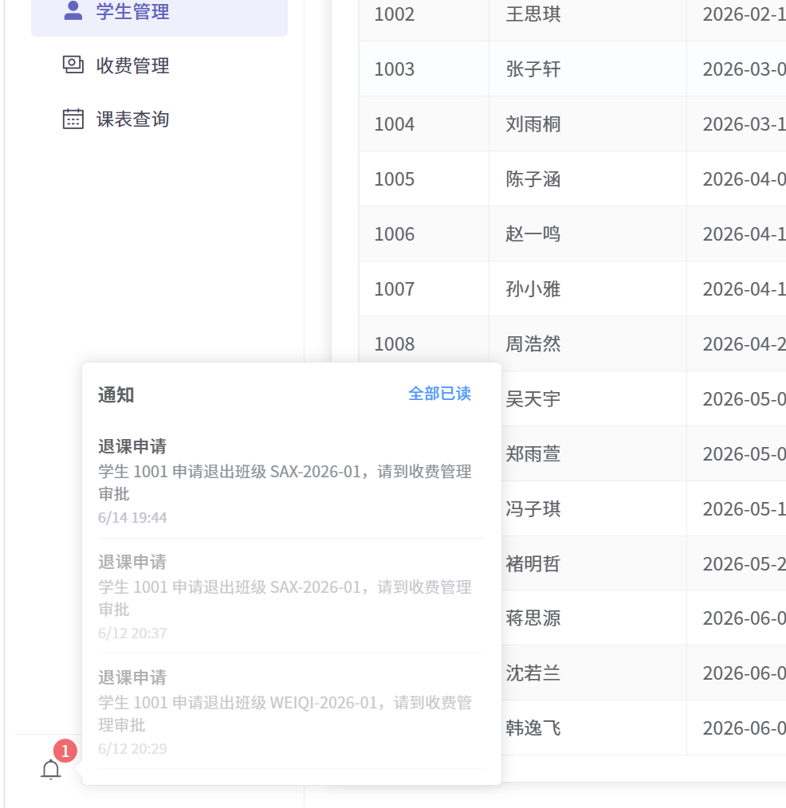
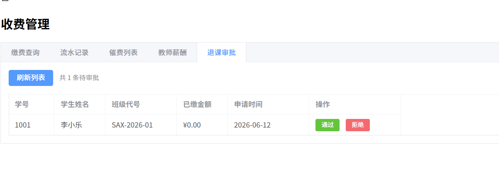

# Day09 · 2026.6.14

### 1、打印账单
之前遗漏了开具收据和打印收费清单。学生端「已选课程」页面加了「全部收据」按钮，点击弹出缴费明细，再点打印就出纸质账单。课设要求的收据和收费清单两项都补齐了。

### 2、退课审批小铃铛
防止恶意退选课，学生端退课时向管理员发出申请，管理端铃铛出现消息提示，管理员可以同意或拒绝。

### 3、收尾课设报告
补了第 7 章「总结与展望」：工作总结从数据库、核心业务、测试排错三个角度收束；展望列了 Redis 分布式锁、WebSocket 推送、HTTPS、密码加密四个方向，跟没做的加分项对应。第 6 章开头"共发现并修复 10 个关键问题"改成 6 个，正文就列了 6 个，数字对不上。

### 4、小铃铛补全
之前铃铛只管退课审批。但报名、缴费、排课、建账号这些事，相关的人也该收到通知。在五个 Service 里加了：

学生缴费：结清发🎉，部分付发💰，带班级名和金额，发管理员。
学生报名：通知管理员（标出是否缴费）、通知教师（谁来了）、通知学生本人（班级、老师、学费）。
学生退课：原来只走审批流程，补了通知教师（谁走了，还剩多少人）。
新增班级：通知被安排的教师（时间、教室）。
修改班级：时间/教室/教师变更，通知教师和全班在读学生。
新建教师/学生账号：通知本人，带初始密码。
班级满员：通知管理员🈵。

纯后端改动，前端铃铛不用动。联调过了，报名→缴费→通知三方都通。
