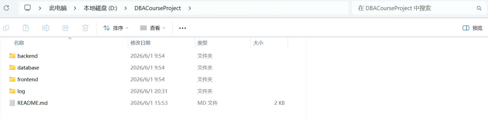

# Day01
2026.6.1


## 今日完成


1. 阅读并分析课程设计需求，明确系统主题为“托管培训中心信息管理系统”。

2. 创建 GitHub 仓库 DBACourseProject。

3. 在本地创建项目目录结构：


```text

database

backend

frontend

log

README.md

```



1. 完成 Git 仓库初始化并成功推送至 GitHub。

2. 分析业务需求，确定系统采用前后端分离架构。

3. 初步确定技术栈：


* 前端：Vue3

* 后端：Spring Boot + MyBatis

* 数据库：MySQL


7. 对业务流程进行梳理，发现“课程—教师—教室—班级”关系是系统设计核心，为后续数据库建模做好准备。


## 遇到的问题


1. 对 Git 仓库创建和远程仓库关联流程不熟悉。

2. 不清楚课程设计项目的标准目录结构。


## 解决过程


1. 完成 GitHub 仓库创建。

2. 学习 Git 基本命令（init、add、commit、push）。

3. 建立符合课程要求的项目目录结构。


## 明日计划


1. 绘制系统 E-R 图。

2. 确定数据库表结构。

3. 编写 create.sql 建表脚本。

4. 完成数据库逻辑设计。


