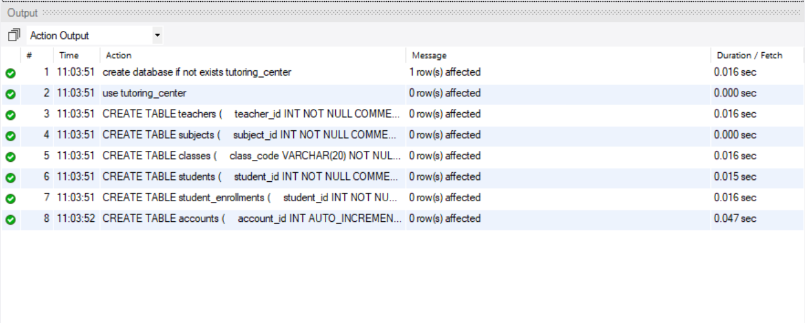
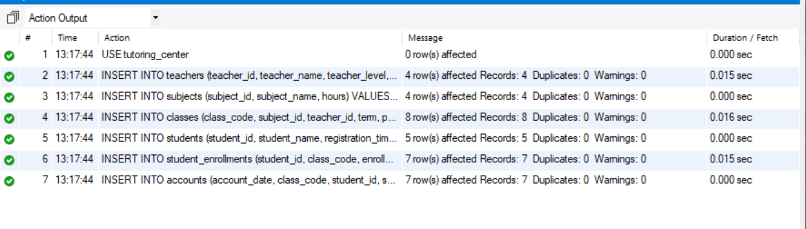
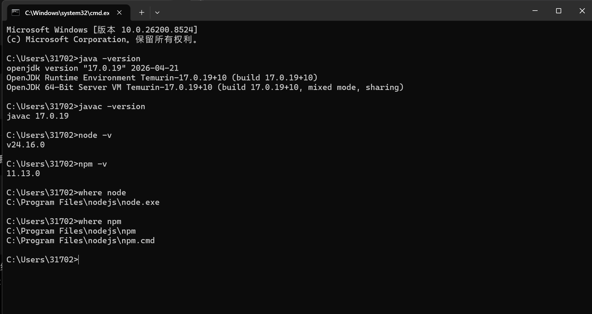
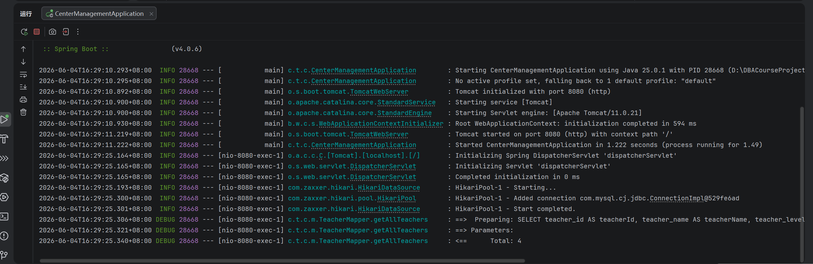
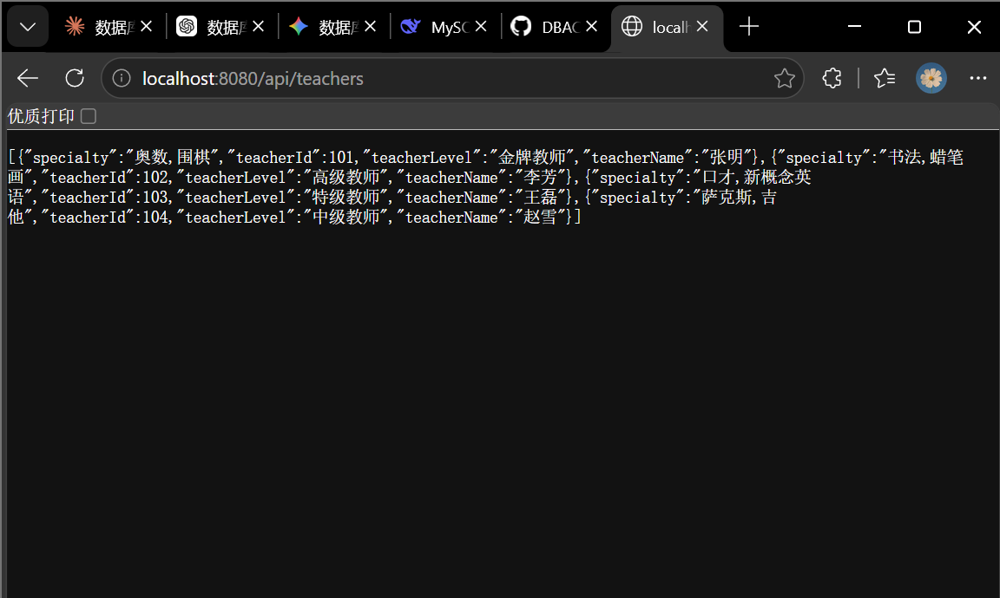

# Day02
## 2026.6.3~2026.6.4

## ER图的设计
 根据系统业务需求，分析系统实体及其关系，确定学生、教师、课程、班级、教室等核心实体，建立实体之间联系的梳理，明确各实体的主键及主要属性。完成了托管培训中心信息管理系统**ER**图设计。

---
## 问题发现与硬核重构过程

### 1、学生与科目的多对多关系灾难
 **初始要求**：学生信息中包含“所选科目（可能不止一门）”。

**思考漏洞**：如果在学生表里用一个字段去存多个科目（比如用逗号分隔**1,2,3**），这严重违反了**第一范式（1NF）**，后续根本无法通过**SQL**进行精确的报名统计、取消选课或计算财务。

**优化方案**：解耦学生表与科目表，引入**学生报名选课关联表（student_enrollments）**，将多对多关系降维为两个一对多，确保数据的原子性。

### 2、同一科目不同教师的“定价与课时报酬”混乱
**初始要求**：科目信息包含“收费、教师号”；教师信息包含“教师等级”。维护科目时“同一门课程知名度不同的教师承担，收取的学费也不同，教师的课时报酬也不同”。

**思考漏洞**：如果把“收费”和“教师号”直接死绑在科目表（比如奥数）里，那就意味着一个科目只能有一个老师、一个价格。这和“同一科目可以由不同老师带，且价格不同”的业务场景完全冲突。

**优化方案**：抽象出 **“班级/开课表（****classes****）”** 。科目表只定义纯粹的科目属性（如奥数、围棋），而具体的某次开课则由班级表承载，并在班级表中显式绑定**subject_id**、**teacher_id**、该班级实际学费（**class_fee**）以及该教师的课时报酬（**teacher_pay**）。

### 3、财务账目与名额控制的闭环缺失
**初始要求**：如果科目满员则提醒学员；管理账目需要打印收费清单。

**思考漏洞**：
1、 满员控制不能只靠前端，数据库必须支持高并发下的名额校验，需要记录“限额”与“已报人数”。
2、 学生交费可能是分期的、也可能包含欠费，初始账目信息缺乏“应缴”、“已缴”和“缴费状态”的动态追踪。

**优化方案**：
1、 在 **classes** 表中添加  **max_capacity（招收限额）** 与 **enrolled_count（已报名人数）** 字段，为后续后端并发锁名额做准备。
2、 在关联表中引入**total_due（应缴总额）**、**amount_paid（累计已缴）**，并设立**payment_status（缴费状态：未缴清/已缴清）**。
3、 提取独立的 **财务账目流水明细表（accounts）**，每次交费生成一条不可逆的流水记录，用于打印收费清单。

---
## 数据表详细结构设计

### 1. 学生基本信息表 (students)

| 字段名 | 数据类型 | 约束 | 备注 |
| :--- | :--- | :--- | :--- |
| **student_id** | INT | PRIMARY KEY, AUTO_INCREMENT | 学生唯一编号 (主键) |
| **student_name** | VARCHAR(50) | NOT NULL | 学生姓名 |
| **created_at** | TIMESTAMP | DEFAULT CURRENT_TIMESTAMP | 账号创建/录入时间 |

### 2. 教师基本信息表 (teachers)

| 字段名 | 数据类型 | 约束 | 备注 |
| :--- | :--- | :--- | :--- |
| **teacher_id** | INT | PRIMARY KEY, AUTO_INCREMENT | 教师唯一编号 (主键) |
| **teacher_name** | VARCHAR(50) | NOT NULL | 教师姓名 |
| **teacher_level**| VARCHAR(20) | NOT NULL | 教师等级 (如：初级、骨干、名师) |
| **specialty** | VARCHAR(100)| DEFAULT NULL | 教师特长/主授科目说明 |

### 3. 课程科目母表 (subjects)

| 字段名 | 数据类型 | 约束 | 备注 |
| :--- | :--- | :--- | :--- |
| **subject_id** | INT | PRIMARY KEY, AUTO_INCREMENT | 科目唯一号 (主键) |
| **subject_name** | VARCHAR(50) | NOT NULL, UNIQUE | 科目名称 (如：奥数、围棋、书法) |
| **total_hours** | INT | NOT NULL | 标准总学时 |
| **period_weeks** | INT | NOT NULL | 建议上课周期 (周数) |

### 4. 实际开班排课表 (classes)

| 字段名 | 数据类型 | 约束 | 备注 |
| :--- | :--- | :--- | :--- |
| **class_id** | INT | PRIMARY KEY, AUTO_INCREMENT | 班级代号 (主键) |
| **subject_id** | INT | FOREIGN KEY, NOT NULL | 所属科目 (外键，关联 subjects) |
| **teacher_id** | INT | FOREIGN KEY, NOT NULL | 代课教师 (外键，关联 teachers) |
| **tuition_fee** | DECIMAL(10,2) | NOT NULL | 该班级实际学费 (根据教师等级有所不同) |
| **teacher_pay** | DECIMAL(10,2) | NOT NULL | 该教师该课时应得报酬 |
| **classroom** | VARCHAR(50) | NOT NULL | 上课地点/教室 |
| **schedule_time**| VARCHAR(100) | NOT NULL | 上课日程与具体时间段 |
| **max_capacity** | INT | NOT NULL | 招收人数限额 |
| **enrolled_count**| INT | DEFAULT 0 | 当前已报名人数 |

### 5. 学生报名选课关联表 (student_enrollments)

| 字段名 | 数据类型 | 约束 | 备注 |
| :--- | :--- | :--- | :--- |
| **enrollment_id** | INT | PRIMARY KEY, AUTO_INCREMENT | 选课条目ID (主键) |
| **student_id** | INT | FOREIGN KEY, NOT NULL | 学生编号 (外键，关联 students) |
| **class_id** | INT | FOREIGN KEY, NOT NULL | 班级代号 (外键，关联 classes) |
| **enroll_time** | DATETIME | NOT NULL | 精确报名时间 |
| **total_due** | DECIMAL(10,2) | NOT NULL | 应缴学费总额 |
| **amount_paid** | DECIMAL(10,2) | DEFAULT 0.00 | 累计已缴金额 (反规范化字段，利于对账) |
| **payment_status**| VARCHAR(20) | DEFAULT 'UNPAID' | 缴费状态 ('UNPAID':未缴, 'PARTIAL':部分, 'PAID':已清) |

### 6. 财务账目流水明细表 (accounts)

| 字段名 | 数据类型 | 约束 | 备注 |
| :--- | :--- | :--- | :--- |
| **account_id** | INT | PRIMARY KEY, AUTO_INCREMENT | 账目流水号 (主键) |
| **payment_date** | DATETIME | NOT NULL | 交易/交款日期 |
| **student_id** | INT | FOREIGN KEY, NOT NULL | 学生编号 (外键，关联 students) |
| **class_id** | INT | FOREIGN KEY, NOT NULL | 班级代号 (外键，关联 classes) |
| **amount_paid** | DECIMAL(10,2) | NOT NULL | 本次实际交款金额 |
| **receipt_no** | VARCHAR(50) | UNIQUE, NOT NULL | 自动生成的收据/发票编号 |
| **created_at** | TIMESTAMP | DEFAULT CURRENT_TIMESTAMP | 记录入账系统时间 |

---
## MYSQL Workbench中成功建表：

---
## 在表中成功插入数据：

---
## 今日开发环境

### 1. 后端环境：JDK 17 (Java 开发环境)

**安装版本**：**OpenJDK 17.0.19 (Temurin)**
**功能作用**：提供Java编译和运行环境，准备**Spring Boot** 后端工作
 
### 2. 前端环境：Node.js & npm

**安装版本**：**Node.js v24.16.0**和**npm 11.13.0**
**功能作用**：提供前端依赖管理和构建工具，为 **Vue / Vite** 前端开发打下坚实基础。

---
## 项目进展回顾：从零开始构建 Spring Boot 项目

到目前为止，我已经利用 **IntelliJ IDEA** 从零开始完成了以下工作：

### 创建 Spring Boot 项目
1、 **创建方式**：在 IDEA 中通过 **Spring Initializr** 创建了一个 **Maven** 项目。
2、 **项目名称**：**center-management**
3、 **环境与依赖**：选择了 **JDK 17** ，添加了核心依赖：**Spring Web、MyBatis Framework、MySQL Driver**

### 配置数据库连接
在 **src/main/resources/application.properties** 中完成了以下关键配置：
1、 **基础连接**：数据库 URL（指向本地的 **tutoring_center** 数据库）、用户名和密码。
2、 **MyBatis 优化**：开启了驼峰命名映射（**map-underscore-to-camel-case=true**）
配置了 **Mapper XML** 位置和实体类包别名。
3、 **调试支持**：配置了日志级别，方便在控制台直接查看 **SQL** 执行详情。

### 创建标准的四层代码结构
项目已经建立了清晰的分层架构：
1 、**实体层 (entity)**：**Teacher.java**—— 包含教师属性及对应的 **getter/setter**。
2、 **数据访问层 (mapper)**：**TeacherMapper.java**—— 使用 **@Select** 注解直接编写 **SQL** 语句。
3、 **业务逻辑层 (service)**：**TeacherService.java** —— 负责核心业务逻辑并调用 **Mapper** 层。
4、 **控制层 (controller)**：**TeacherController.java** —— 提供 **REST API**，对外暴露访问路径 **/api/teachers**。

### 成功运行并测试第一个 API
1、 **应用启动**：成功启动了**Spring Boot**应用程序。
2、 **接口测试**：访问 http://localhost:8080/api/teachers， 正确返回了数据库 `teachers` 表中所有教师数据的 **JSON** 格式。
3、 **成果验证**：验证了**数据库连接**、4、 **MyBatis 映射**以及**前后端交互**的全流程正确性。

---
## 明日计划
1、 完成其他基础实体的API（参考 Teacher 的做法）
2、 实现核心业务“学生报名”
3、 账目管理
4、 日程查询