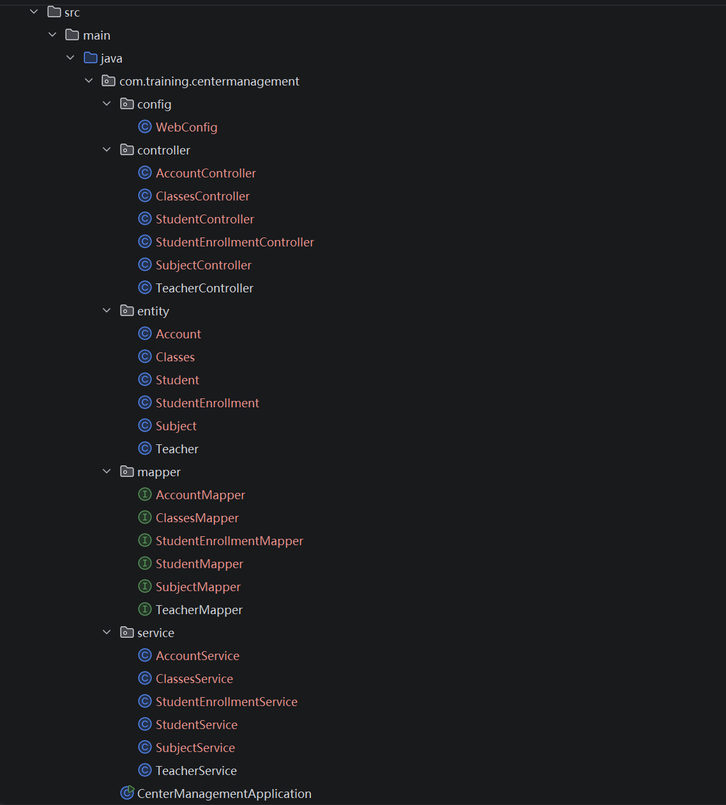
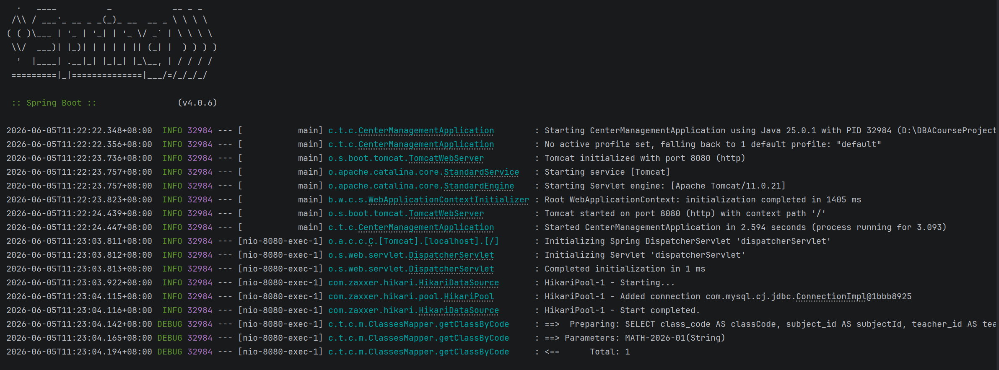
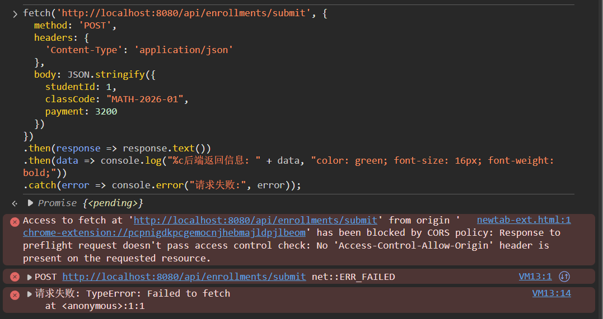
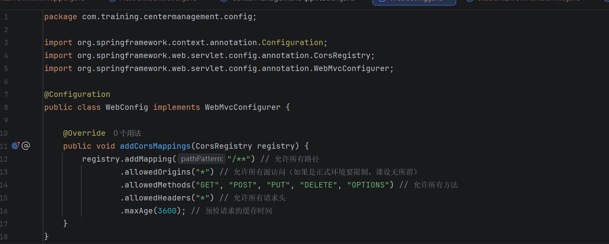
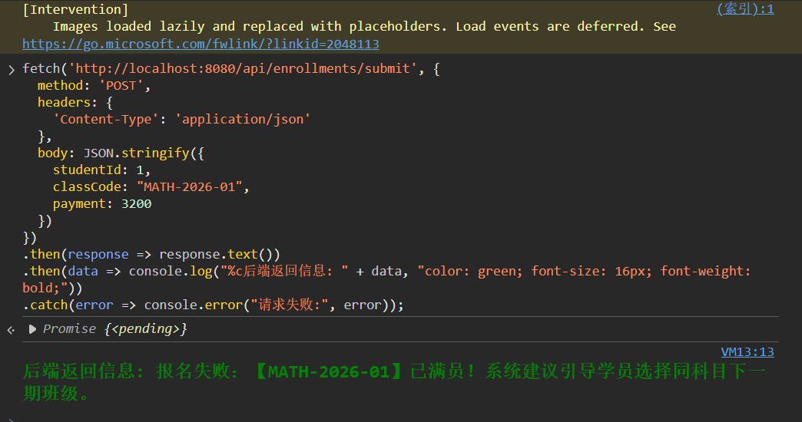
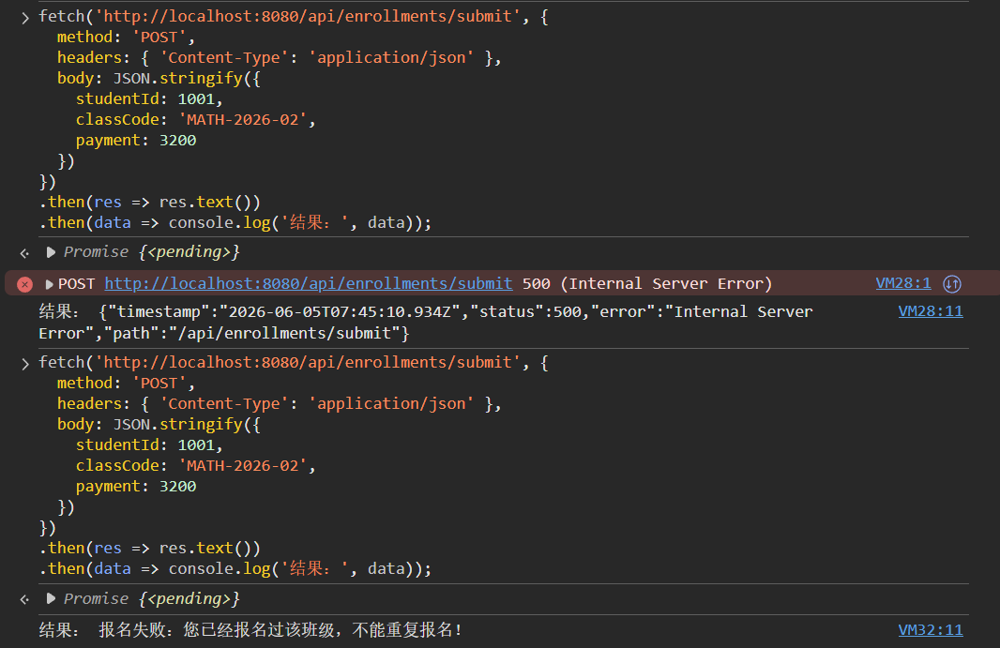
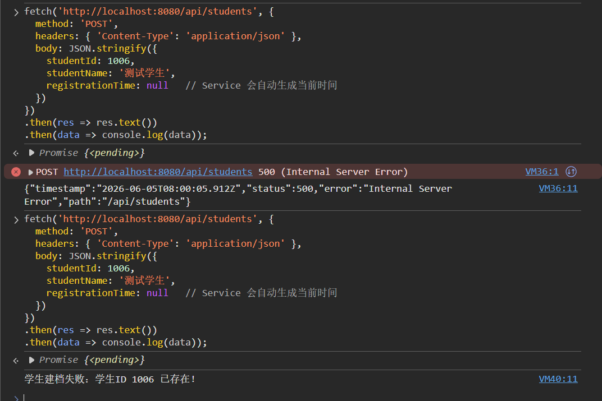
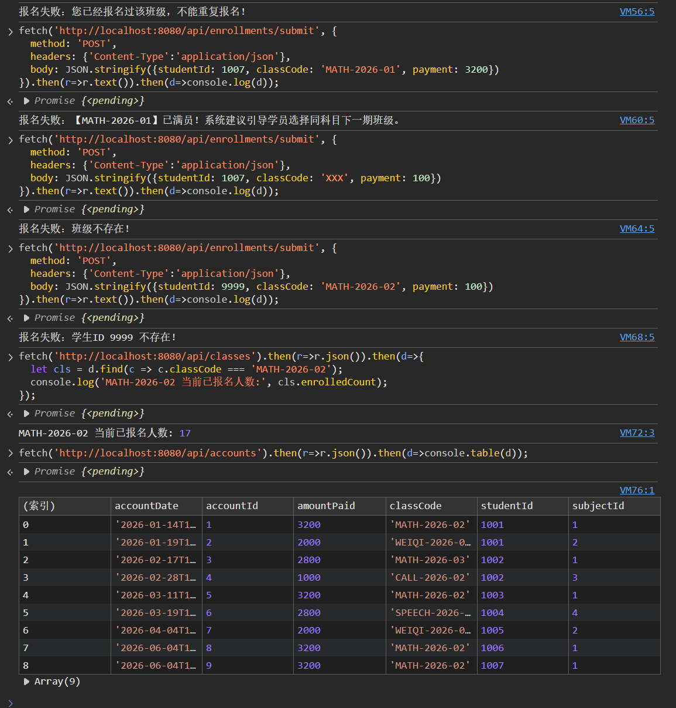

# Day 03
## 2026.6.5

## SpringBoot项目搭建
截至目前，已完成后端系统的整体开发工作，包括数据库 6 张核心数据表的设计与测试数据初始化，以及 Spring Boot 项目的创建与基础配置。项目采用标准 MVC 分层架构，完成了 Entity、Mapper、Service、Controller 四层代码开发，并配置了全局跨域访问功能，为后续 Vue 前端对接做好准备。

在功能实现方面，已完成教师、科目、班级、学生和账目等基础业务模块的 REST API 开发，同时实现了学生报名核心业务流程，包括班级满员检查、事务管理、报名人数自动更新以及账目流水记录等功能。系统还增加了防重复报名、防重复学生 ID、防重复班级代号以及外键存在性校验等数据完整性控制措施。所有接口均已完成测试验证，正常业务流程和异常场景均能够正确处理，后端系统已具备与前端联调的条件。

---
## 程序调试
在**IJ**端能成功运行：

但是，浏览器调试阶段出现了问题。。。

我的前端代码（在浏览器控制台里执行）想向 http://localhost:8080/api/enrollments/submit 发送请求，但是：当前页面所在的源与后端接口的源不同。浏览器认为这是跨域请求，因此先发送一个预检请求询问服务器是否允许跨域。我的后端没有返回Access-Control-Allow-Origin响应头，所以预检失败，整个请求被浏览器拦截。**根本原因是后端没有配置跨域支持**。
#### 最终解决方法 
于是我在src/main/java/com/training/centermanagement/下面创建一个config文件夹，写入一个**WebConfig.java**代码

运行成功：

#### 重复查询
会出现报错，原因是没有设置检测算法，于是我在**StudentEnrollmentMapper.java**和**StudentMapper.java**中添加查询方法，在**StudentEnrollmentService.java**和**StudentService.java**添加重复报名检查的算法。于是解决了这个问题：

 在做了防重复报名、防重复学生 ID、防重复班级代号、外键存在性校验这些操作后，在浏览器进行调试完成预期调试任务。
 

---
## 今日总结

总体来说，效率没有想象中的那么高，一直在调试，修改代码，但是在调试中能发现大部分漏洞。所以初步搭建很快，但是想长期稳定运行还是得不断调试发现问题。

| 需求点 | 完成情况 |
|--------|---------|
| 处理学生报名（检查满员、选择教师、交费、开清单） | 核心流程完成（满员检查、人数更新、流水记录、事务）。但缺少“根据科目查询班级”接口（需要前端自己筛选）以及“开具收费清单”的返回格式。 |
| 维护科目 |  **只完成了科目查询，没有科目的增删改。** |
| 安排教室及上课日程 |  **没有提供学生/教师课表接口。** |
| 管理帐目（入帐、收据、清单、催费） | **只有报名时的一次缴费，缺少单独缴费、打印清单、催费接口。** |
| 数据要求：学生信息含交款额 |  **students 表没有 total_paid 字段，也没有通过其他方式便捷查询。** |
| 科目信息（上课周期、收费、地点、教师号、招收人数、已报名人数） |  classes 表完整包含，且提供查询接口。 |
| 教师信息 | 已提供。 |
| 账目信息 | 表结构完整，提供流水查询接口。 |