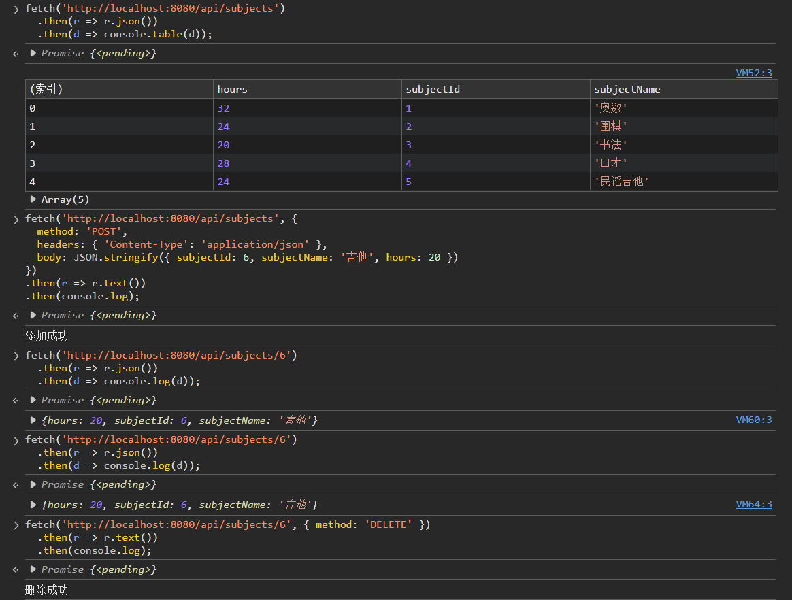
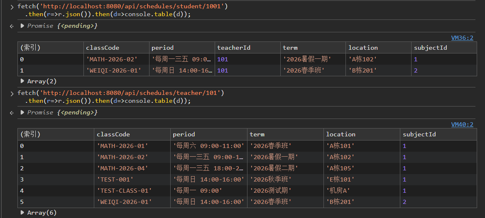
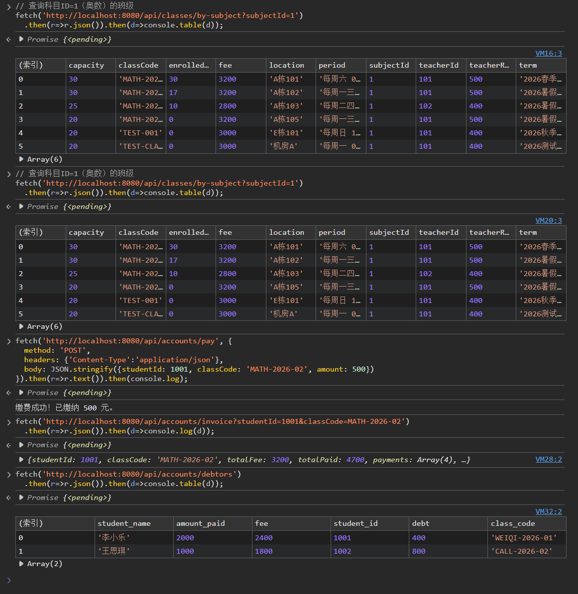
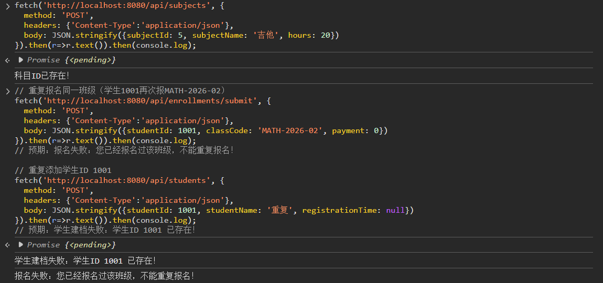
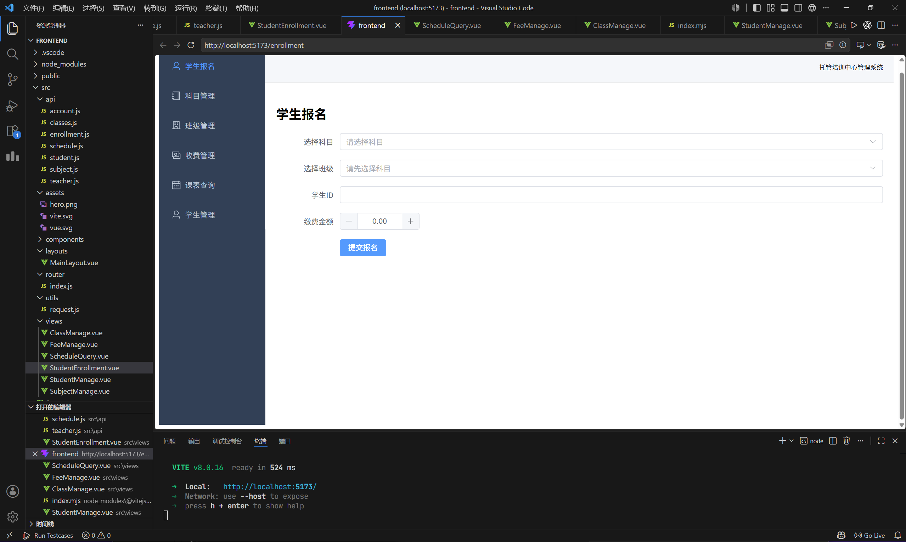

# Day04
## 2026.6.6

## 一、后端的完善

根据昨日 Day03 末尾梳理的未完成清单，今天首先对后端进行了系统性补齐。

### 1.1 科目维护模块 — 增删改查完整实现

Day03 中科目模块仅有查询功能。今天在 `SubjectService.java` 中补充了新增、更新、删除逻辑，并在 `SubjectController.java` 中暴露了对应的 REST 接口：

| 方法 | 接口 | 说明 |
|------|------|------|
| GET | `/api/subjects` | 查询全部科目 |
| GET | `/api/subjects/{id}` | 按 ID 查询单个科目 |
| POST | `/api/subjects` | 新增科目（含 ID 重复校验） |
| PUT | `/api/subjects` | 更新科目信息 |
| DELETE | `/api/subjects/{id}` | 删除科目（含外键约束检查：如该科目下有关联班级则阻止删除） |



### 1.2 教室安排及上课日程 — 学生/教师课表接口

新增 `ScheduleService.java` 和 `ScheduleController.java`，提供双向课表查询：

- **学生课表** `GET /api/schedules/student/{studentId}`：根据学生 ID，查询其已报名的所有班级，返回上课时间、教室、科目、期次等信息。
- **教师课表** `GET /api/schedules/teacher/{teacherId}`：根据教师 ID，查询其承担的全部班级排课信息。

实现方式：通过 `StudentEnrollmentMapper` 获取学生选课记录中的班级代号，再联表 `ClassesMapper` 组装课表；教师课表则直接按 `teacher_id` 查询班级表。



### 1.3 账目管理完善 — 单独缴费、收费清单、催费列表

在 `AccountService.java` 中新增三个核心方法：

**（1）单独缴费 `makePayment`**
- 校验学生是否已报名该班级
- 写入 `accounts` 账目流水表
- 同步更新 `student_enrollments` 表中的 `amount_paid`（累加已缴金额）
- 使用 `@Transactional` 保证事务一致性

**（2）收费清单 `getInvoice`**
- 查询班级标准学费 (`classes.fee`)
- 查询该生在该班级的累计已缴 (`student_enrollments.amount_paid`)
- 计算欠费 = 应缴 - 已缴
- 返回完整的缴费明细列表

**（3）催费列表 `getDebtors`**
- 通过 SQL 关联查询所有 `amount_paid < fee` 的欠费记录
- 返回学生姓名、班级、应缴、已缴、欠费差额等信息

对应 `AccountController.java` 暴露接口：

| 方法 | 接口 | 说明 |
|------|------|------|
| GET | `/api/accounts` | 查询全部流水 |
| POST | `/api/accounts/pay` | 单独缴费 |
| GET | `/api/accounts/invoice` | 打印收费清单 |
| GET | `/api/accounts/debtors` | 查询欠费学生列表 |



### 1.4 按科目查询班级接口

在 `ClassesController.java` 中新增 `GET /api/classes/by-subject?subjectId=` 接口，支持前端报名页面在选择科目后动态加载对应班级列表，替代前端自行筛选逻辑。


### 1.5 学生缴费统计方案

课程设计数据要求中"学生信息含交款额"。经分析，缴费总额应通过 `student_enrollments.amount_paid`（选课桥接表累计已缴）和 `accounts` 流水表联合查询实现——这是正确的规范化设计：payment 在 enrollment 层面追踪，避免在 students 表中引入冗余字段导致数据不一致。因此未在 students 表添加 total_paid 冗余列。

### 1.6 完整接口测试

对全部后端接口进行了回归测试，覆盖以下场景：

- 正常业务流程：科目→班级→报名→缴费→清单→课表
- 异常场景：重复报名拦截、重复学生 ID 拦截、重复班级代号拦截、外键不存在拦截、满员拦截



---

## 二、前端工作

### 2.1 项目环境与依赖搭建

**2.1.1 环境准备**
- Node.js v24.16.0 + npm 11.13.0（Day02 已完成安装）
- 使用 `npm create vite@latest` 创建 Vue 3 项目

**2.1.2 核心依赖安装**

| 依赖 | 版本 | 作用 |
|------|------|------|
| vue | 3+ | 前端核心框架 |
| vue-router | 4+ | 单页面路由管理 |
| axios | 最新 | HTTP 请求库 |
| element-plus | 最新 | UI 组件库（表格、表单、弹窗、导航等） |
| @element-plus/icons-vue | 最新 | Element Plus 图标库 |
| unplugin-vue-components | 最新 | Element Plus 组件自动按需导入 |

### 2.2 前端目录结构

```
frontend/src
├── api/                  # API 接口层（6个模块）
│   ├── teacher.js        #   教师接口
│   ├── subject.js        #   科目接口
│   ├── classes.js        #   班级接口
│   ├── student.js        #   学生接口
│   ├── enrollment.js     #   报名接口
│   ├── account.js        #   账目接口
│   └── schedule.js       #   课表接口
├── layouts/
│   └── MainLayout.vue    # 主布局（侧边栏 + 顶部导航 + 内容区）
├── router/
│   └── index.js          # 路由配置（6个页面路由 + 默认重定向）
├── utils/
│   └── request.js        # Axios 全局封装（baseURL、拦截器）
├── views/                # 页面组件（6个）
│   ├── StudentEnrollment.vue   # 学生报名页
│   ├── SubjectManage.vue       # 科目管理页
│   ├── StudentManage.vue       # 学生管理页
│   ├── ClassManage.vue         # 班级管理页
│   ├── FeeManage.vue           # 收费管理页
│   └── ScheduleQuery.vue       # 课表查询页
├── App.vue               # 根组件
└── main.js               # 入口文件
```

### 2.3 关键架构设计

**2.3.1 Axios 全局封装 (`utils/request.js`)**
- 统一 baseURL：`http://localhost:8080/api`
- 响应拦截器：自动解包 `response.data`，统一错误弹窗提示
- 超时时间：15 秒

**2.3.2 路由设计 (`router/index.js`)**

| 路由路径 | 页面组件 | 菜单名称 |
|----------|----------|----------|
| `/` | → 重定向至 `/enrollment` | — |
| `/enrollment` | StudentEnrollment | 学生报名 |
| `/subjects` | SubjectManage | 科目管理 |
| `/classes` | ClassManage | 班级管理 |
| `/fee` | FeeManage | 收费管理 |
| `/schedule` | ScheduleQuery | 课表查询 |
| `/students` | StudentManage | 学生管理 |

**2.3.3 布局组件 (`MainLayout.vue`)**
- 左侧：Element Plus 菜单导航，绑定路由，支持高亮当前页面
- 右侧顶部：系统标题栏
- 右侧中部：`<router-view />` 路由出口

### 2.4 页面实现详情

#### 2.4.1 学生报名页 `StudentEnrollment.vue`（今日上午完成）

核心交互流程：
1. 用户从下拉菜单选择科目 → 触发 `onSubjectChange`
2. 调用 `GET /api/classes/by-subject?subjectId=` 加载该科目下的班级列表
3. 每个班级选项展示：班级代号、上课时间、费用、剩余名额
4. 用户填写学生 ID 和缴费金额，点击提交
5. 调用 `POST /api/enrollments/submit` 完成报名（含满员拦截、重复报名拦截等）



#### 2.4.2 科目管理页 `SubjectManage.vue`（今日上午完成）

- 表格展示全部科目（科目编号、名称、课时数）
- 新增按钮 → 弹窗表单
- 每行提供编辑和删除按钮
- 编辑弹窗中科目编号不可修改
- 删除前弹窗确认，防止误删

#### 2.4.3 学生管理页 `StudentManage.vue`（今日上午完成）

- 内联表单：学生 ID + 姓名，快速新增
- 下方表格展示学生列表（ID、姓名、注册时间）

#### 2.4.4 班级管理页 `ClassManage.vue`（今日下午完成）

- 表格展示全部班级：代号、科目（映射名称）、教师（映射名称）、期次、上课时间、学费、教室、名额（已报/上限）、教师报酬
- 新增班级弹窗：所有字段完整录入，科目和教师通过下拉选择（动态加载）

#### 2.4.5 收费管理页 `FeeManage.vue`（今日下午完成）

采用 `el-tabs` 分为四个 Tab：

| Tab | 功能描述 |
|-----|----------|
| 流水记录 | 展示全部缴费流水（流水号、日期、班级、学生、科目、金额） |
| 单独缴费 | 输入学生 ID + 班级代号 + 金额，调用缴费接口 |
| 收费清单 | 输入学生 ID + 班级代号，展示应缴/已缴/欠费对比 + 缴费明细列表 |
| 催费列表 | 查询全部欠费记录，欠费金额红色高亮显示 |

#### 2.4.6 课表查询页 `ScheduleQuery.vue`（今日下午完成）

采用 `el-tabs` 分为两个 Tab：

| Tab | 功能描述 |
|-----|----------|
| 学生课表 | 输入学生 ID → 查询该生全部班级的上课时间、教室、科目 |
| 教师课表 | 输入教师 ID → 查询该教师全部排课的班级、时间、地点 |

科目 ID 自动映射为科目中文名称。

### 2.5 构建验证

**前端构建**：
```bash
npm install     # 依赖安装成功（0 vulnerabilities）
npx vite build  # 生产构建成功（2.98s），无编译错误
```

**后端编译**：
```bash
./mvnw compile  # BUILD SUCCESS，28 个源文件编译通过
```

---

## 三、今日遇到的问题与解决

### 问题 1：前端页面状态管理
**现象**：ClassManage.vue 新增班级后表格不刷新。
**解决**：在 `saveClass` 成功后调用 `await loadData()` 重新拉取全部数据。

### 问题 2：科目和教师名称无法直接展示
**现象**：班级表中仅存储 `subject_id` 和 `teacher_id` 外键，前端表格无法直接显示中文名称。
**解决**：在 `onMounted` 中通过 `Promise.all` 并行加载班级、科目、教师三组数据，编写 `getSubjectName()` 和 `getTeacherName()` 辅助函数进行 ID→名称映射。

### 问题 3：收费清单数据组装
**现象**：后端返回的 invoice 对象结构较复杂（包含班级信息、缴费明细数组）。
**解决**：使用 `el-descriptions` 组件展示汇总信息（应缴/已缴/欠费），使用 `el-table` 展示缴费明细数组，通过 `v-if` 条件渲染避免空数据报错。

---

## 四、项目当前状态总览

| 模块 | 完成度 | 说明 |
|------|--------|------|
| 数据库设计 | 100% | 6 张表，含外键约束与测试数据 |
| 后端 API | 100% | 7 个 Controller，完整 CRUD + 核心业务流程 + 事务管理 |
| 前端页面 | 100% | 6 个页面全部完成，功能性组件 |
| 前后端联调 | 待进行 | 前后端独立编译均已通过 |
| 日志文档 | 100% | Day01～Day04 全部完成 |
| 课设报告 | 待写 | 报告模版已就绪 |
| 加分项 | 1/6 | 仅完成事务管理，其余选做 |

---

## 五、明日计划

1. 启动后端与前端，进行全流程前后端联调测试
2. 修复联调过程中发现的问题
3. 开始撰写课程设计报告
4. 根据剩余时间酌情选做加分项（Redis 缓存、分布式锁等）
