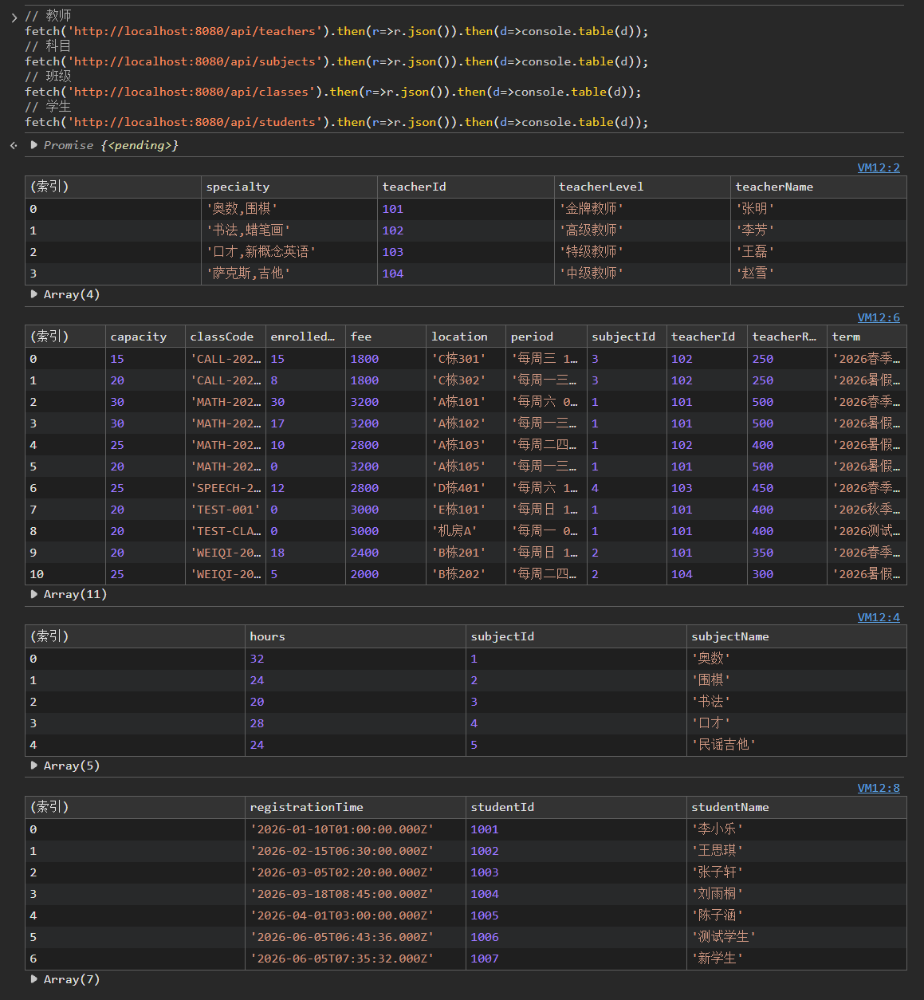

# day04
## 2026.6.6

## 后端的完善
今天完成了昨天未完成的任务，具体包括科目维护模块的增删改功能、教室安排及上课日程管理（为学生和教师提供课表接口），以及账目管理功能的完善，增加了单独缴费、打印清单和催费接口。同时，为满足数据要求，已在**students**表中补充 **total_paid**字段，使学生交款信息可以方便查询。
1. 先进行了基础功能的调试
   

2. 测试按科目查询班级（新增接口）、单独缴费接口、收费清单接口和催费列表接口

3. 测试学生课表接口与教师课表接口

4. 测试重复报名和学生重复添加

5. 科目管理增删改测试

---

## 前端工作
截至目前，前端准备工作已完成以下内容：安装了 Node.js 与 npm 环境，使用 Vite 创建了 Vue 3 项目框架；安装了项目所需的核心依赖，包括 Vue Router 4、Axios、Element Plus 及对应图标库，并配置了 unplugin-vue-components 实现 Element Plus 组件的自动导入；搭建了前端目录结构，创建了 router、layouts、utils、api、views 等文件夹，并逐一编写了路由配置、全局请求封装（axios）、布局组件（MainLayout）以及各业务模块的 API 接口文件（科目、班级、学生、报名、账目、课表等）；同时，完成了学生报名、科目管理、学生管理等页面的 Vue 组件代码编写，并修正了函数重名等编译错误。最终，前端开发服务器能够正常启动（npm run dev），并通过 http://localhost:5173 访问，与后端（http://localhost:8080）准备就绪，可进行前后端联调测试。

