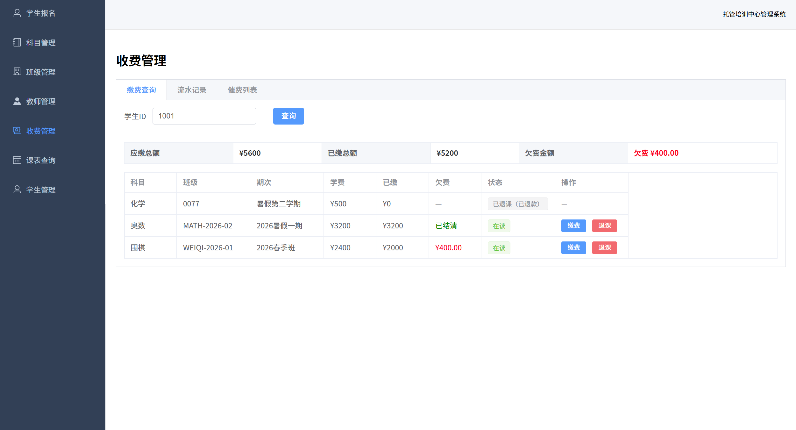
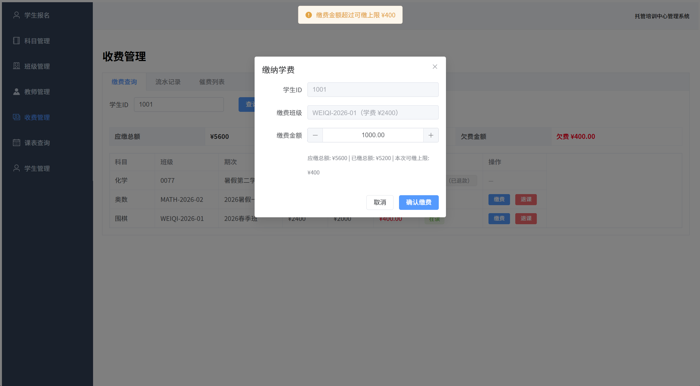
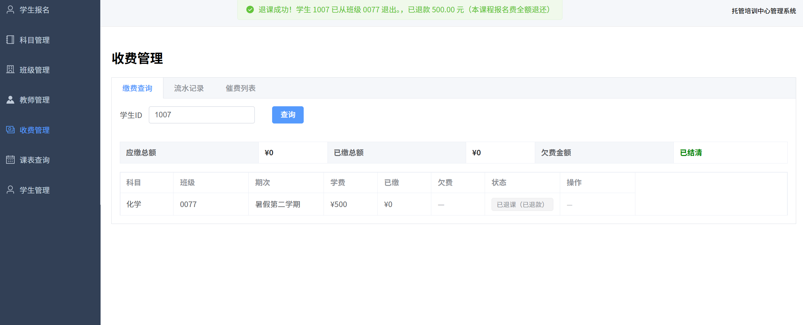
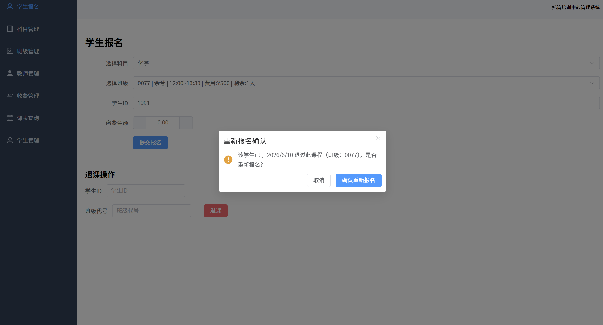

# Day06
## 2026.6.10

## 退款清算系统 + 业务规则优化 + Bug 修复

今天的工作分成两个阶段：上午先把 Day05 遗留的"踢皮球"死锁修了，跑通退款→退课→删除流程；下午根据我提出的几点业务优化建议，对整个收费和退课逻辑做了一次比较大的重构。

---

## 一、踢皮球死锁的解决

### 问题

Day05 发现了一个死循环：

```
想删学生 → 被报名记录卡住
  → 想取消报名 → 流水记录还在，学生删不掉
    → 想删流水 → 钱可能多缴了，没地方退
      → 系统没退款功能 → 死锁
```

### 最开始的做法（后来推翻了）

一开始的想法是：先手动退款 → 再退课（删流水 + 删报名）→ 最后删学生。在收费管理里加了一个"退款"标签页，用户需要先算清楚多缴了多少钱，在退款页操作退款，再去退课。流程能跑通，但操作很繁琐。

### 后来的改进

下午讨论后觉得这个设计不好——退课应该是一键的事情，不应该让用户在好几个页面之间跳转。而且退款退的应该是这门课的报名费全额，而不是只退"多出来的那部分"。于是做了一次比较大的改造：
1. 数据库 `student_enrollments` 表加了 `status` 字段（`active` / `cancelled`）
2. 退课不再删记录，改成 `UPDATE status = 'cancelled'`
3. accounts 流水表永远不动（会计原则：流水只增不删）
4. 删学生/班级时：如果所有报名都是 cancelled，才允许物理清理并删除

---

## 二、业务规则的三点优化

下午我根据自己使用系统时的感受，提了三个改进点，Claude Code 帮我逐一分析并落地。

### 教师特长过滤

**问题**：新增班级时，教师下拉框显示所有老师，但实际上教奥数的老师不应该出现在围棋班里。

**解决**：选了科目之后，系统自动按科目名去匹配老师的特长字段（`specialty LIKE '%奥数%'`），只显示特长对得上的老师。切换科目时会清空已选教师，防止选错。

### 统一缴费查询

**问题**：收费管理页面分了 5 个标签页（流水记录、单独缴费、收费清单、退款、催费列表），找一个学生的缴费情况要在几个页面之间来回切。

**解决**：把单独缴费、收费清单、退款合并成一个"缴费查询"页。输入学生ID就能看到：
1. 该生的全部报名记录（在读 + 已退课都有）
2. 应缴总额、已缴总额、欠费金额
3. 每门课的学费、已缴、状态
4. 每行直接有 [缴费] 和 [退课] 按钮，不用勾选复选框

**缴费规则也改了**：原来每门课单独算额度（这门课最多缴学费那么多），现在改成按学生总维度算——你报了 3 门课一共 7000，那不管钱缴到哪门课上，加起来不能超过 7000。

**关于余额**：按这个规则，学生缴费时系统就拦住了超额，退课时全额退款，所以不存在"多缴"的情况。余额那一栏只会显示"欠费 ¥X"或者"已结清"。

### 退课自动退款

**问题**：原来的退课只是取消报名，钱的事要另外处理。如果学生缴了 3000，学费 2800，多缴的 200 得手动退。

**解决**：现在退课就是退款——点退课按钮，系统自动把这门课已缴的全部金额原路退回（在 accounts 表里插入一条负数记录），然后标记报名为 cancelled。页面上已退课的记录显示"已退课（已退款）"。



---

## 三、联调中修掉的几个 Bug

代码写完不是终点，打开网页实际测了之后才发现问题。

### 3.1 报名时缴费没有限额检查

缴费规则虽然在"单独缴费"里写好了，但报名时的首期缴费（`processEnrollment`）漏掉了这个校验。所以理论上可以在报名页面直接填一个超大的金额绕过去。
**修法**：在报名接口里也加了同样的一套校验逻辑。

### 3.2 退款金额只退了差额

上面提到过，一开始的退课逻辑是"多缴了才退差额"，但正确的逻辑应该是"退课就退全额"。这个修了。

### 3.3 退课后不能再报同一门课

学生退了一门课，过两天想重新报，系统报错"数据已存在"。因为退课只是标记 cancelled，数据库主键还在，INSERT 就冲突了。
**修法**：系统检测到这条 cancelled 记录后，改为 UPDATE 恢复 active 状态（更新缴费金额和报名时间），而不是 INSERT 新记录。前端在提交前会弹确认框："该学生已于 X 日退过此课程，是否重新报名？"

### 3.4 收费管理页面细节调整
1. 去掉了没用的复选框列，每行直接放按钮
2. 流水记录恢复为独立的标签页（不藏在折叠面板里）
3. 催费列表保持按课程维度的展示方式

---

## 四、数据库重置

测试过程中把数据搞乱了，干脆把数据库清空重建。更新了建表 SQL（加上 status 字段），重新插入了测试数据。执行时发现中文编码问题（`\xA3\x8B` 错误），加 `--default-character-set=utf8mb4` 参数解决。

---


## 五、明天计划

1. 继续联调跑完整流程（报名→缴费→退课退款→重新报名→删学生）
2. 开始写课程设计报告
3. 有空的话再加一个加分项
4. 数据库密码明文的问题该处理了