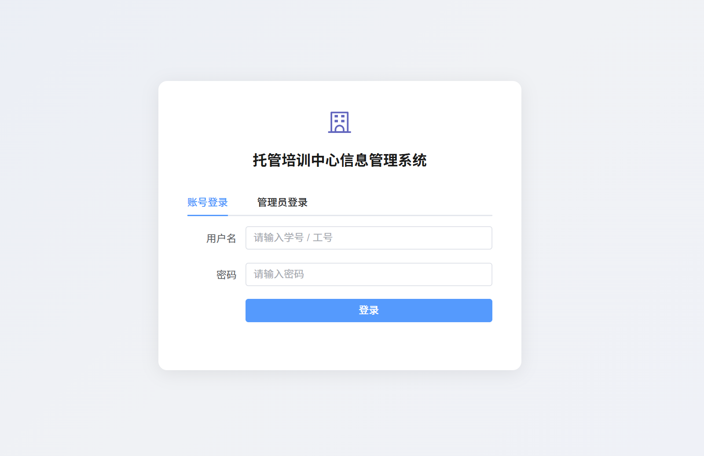
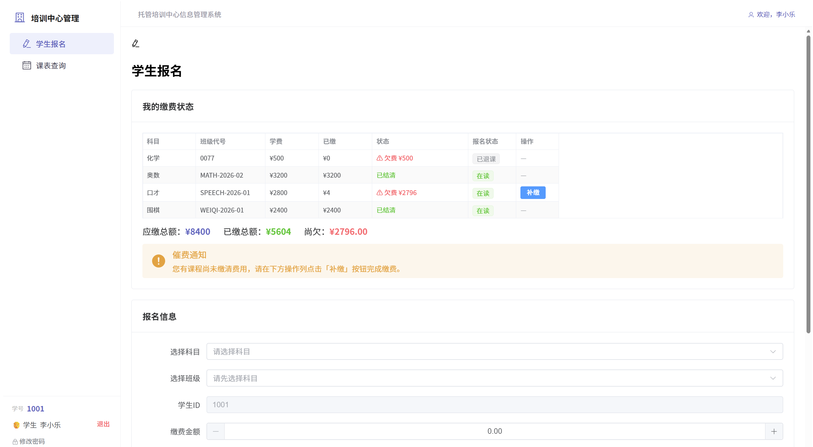
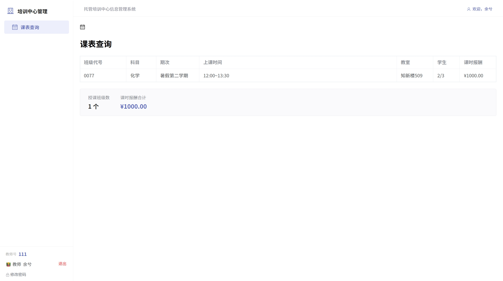
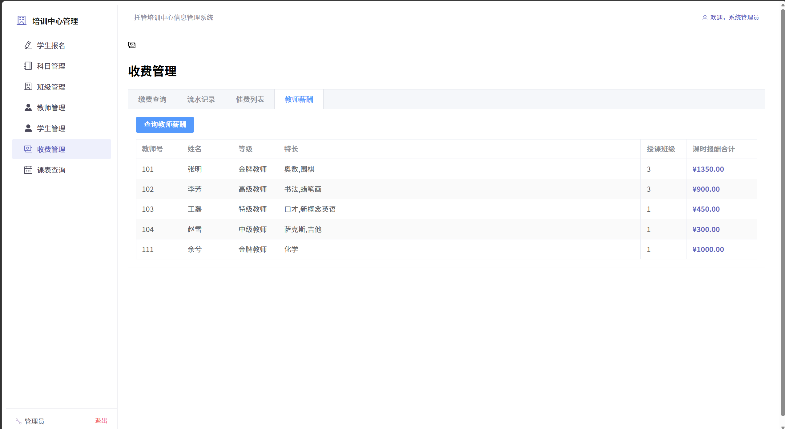
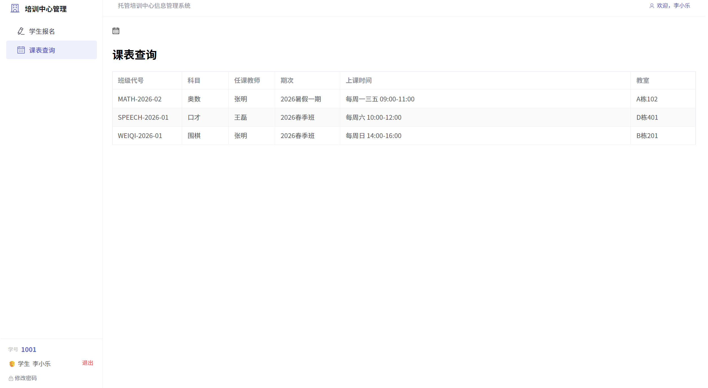

# Day07
## 2026.6.11

## 登录认证系统 + 角色权限 + 教师薪酬 + 全面 UI 优化

今天的工作量比较大，从早上弄到晚上。主要内容：把 Day06 那个"前端假登录"升级成了真正的身份验证系统，新增了教师薪酬功能，修了一堆 UI 上的问题。

---

## 一、从"假登录"到"真认证"

### Day06 的登录有什么问题

Day06 做了一个登录页面，学生和教师选个身份、填个名字就能进去。本质上只是"前端 UI 分流"——学生看到的菜单少，管理员看到的多，但身份没有任何验证。随便输个学号都能登录，教师端也一样。

今天把它彻底重做了。

### 数据库改动

`students` 表和 `teachers` 表各加了一个 `password` 字段，默认值 `111111`。所有已有学生和教师的初始密码都是这个。

```sql
ALTER TABLE students ADD COLUMN password VARCHAR(100) NOT NULL DEFAULT '111111';
ALTER TABLE teachers ADD COLUMN password VARCHAR(100) NOT NULL DEFAULT '111111';
```

### 后端新增

新建了两个文件：
- `AuthService.java`：登录验证 + 改密码的业务逻辑
- `AuthController.java`：两个新接口
  - `POST /api/auth/login`：传入学号/工号 + 密码，后端自动查学生表再查教师表，不用前端告诉它"这个人是学生还是老师"
  - `PUT /api/auth/change-password`：旧密码 → 新密码

StudentMapper 和 TeacherMapper 各加了 `login()` 和 `changePassword()` 两个方法。

### 前端改动

**登录页**：原来三个标签页（学生/教师/管理员），改成两个——「账号登录」和「管理员登录」。学生和老师用同一个入口，输入学号/工号 + 密码，后端自动识别身份。

**侧边栏**：底部显示当前用户的学号/教师号，旁边有"修改密码"按钮（之前写的"改密"两个字，太丑了，换成了带锁图标的"修改密码"）。点退出清除登录状态回到登录页。

**权限控制**：路由加了 `beforeEach` 守卫，学生手动输 `/subjects` 会被踢回报名页。所有身份信息存在 Pinia（一个新的状态管理库，装了一个依赖包）里，刷新页面不会丢。

**管理员**：还是 admin / admin123，但这个信息不再显示在登录页面上了。

### 关于"学生自己注册"

本来考虑过让学生自己注册账号，但想了下，学号是管理员手动分配的，如果学生端能自动生成学号，两个入口会冲突。所以注册这件事只由管理员在后台做，学生拿到学号和初始密码后直接登录就行。

---

## 二、学生端缴费功能完善

### 问题

学生 1001（李小乐）登录进去，缴费状态那一块显示"已结清"，但下面的汇总显示应缴 8400、已缴 5604、尚欠 2796。数据自相矛盾，而且找不到在哪里补缴。

### 根因

后端返回的报名数据里有 `fee`（学费）和 `totalPaid`（已缴），但没有"欠费"这个字段。前端模板写的是 `row.arrears > 0` 来判断要不要显示"欠费"标签，但 `arrears` 在数据里根本不存在，是 `undefined`，`undefined > 0` 永远等于 `false`。所以不管欠不欠费，一律显示绿色的"已结清"。

### 修复

拿到后端数据后，在代码里手动给每一行加上 `arrears = 学费 - 已缴`。

缴费状态表格新增了一个"操作"列，欠费的行会出现「补缴」按钮。点开弹窗可以输入金额，系统会自动限制不能超过尚欠金额。

催费通知的文案也从"请联系管理员缴费"改成了"请在下方点击补缴按钮完成缴费"——学生现在能自己补缴了，不用找管理员。


---

## 三、教师薪酬功能

### 需求

教师登录后应该能看到自己每个班的课时报酬，还要有一个合计。管理员那边也应该能查到所有教师的薪酬情况。

### 实现

**教师端**：课表页面的表格加了"学生人数"和"课时报酬"两列。表格下方有一个灰色汇总卡，显示"授课班级数：X 个"和"课时报酬合计：¥XXX"。

**管理端**：收费管理页面新增了第四个标签页——「教师薪酬」。点"查询教师薪酬"按钮就能看到所有老师的汇总表（姓名、等级、特长、教几个班、总报酬多少）。

**后端**：`ScheduleService` 的教师课表接口多返回了几个字段（课时报酬、学费、报名人数、容量）。新增了 `GET /api/teachers/salaries` 接口。

修路由的时候踩了一个坑：`/api/teachers/salaries` 这个固定路径必须写在 `/{teacherId}` 前面，不然 Spring 会把 "salaries" 当成一个 teacherId 去解析，直接报错。

---

## 四、课表查询页的角色隔离

### 问题 1：学生能看到教师课表标签

学生登录后打开课表查询，页面上有"学生课表"和"教师课表"两个标签页。教师课表那个标签是空的，没有数据，但摆在那里就不合理。教师端也是一样的问题。

### 修复

课表页现在按角色拆成三种模式：
- **学生**：没有标签页，直接显示自己的课表（学号从登录信息自动获取，不需要手动输入）
- **教师**：同上，直接显示自己的课表 + 薪酬汇总
- **管理员**：保留两个标签页 + 手动输入查询


---

## 五、杂项 UI 修整（今天改的东西太多了，列个表）

| 改了什么 | 怎么改的 |
|----------|----------|
| 登录页去侧边栏 | 没登录的时候不渲染侧边栏和顶栏，登录页全屏居中 |
| 顶栏显示用户名 | 原来右上角写死"v1.0"，现在显示"欢迎，李小乐" |
| 登录页背景 | 纯灰改成淡蓝渐变，好看一点 |
| 页面切换动画 | 加了 0.15 秒的淡入淡出，切换页面不再一闪而过 |
| 浏览器标签页图标 | 之前引用了一个不存在的 `/favicon.svg`，换成了 📚 图标 |
| 班级管理金额格式 | 学费和教师报酬统一显示 `¥3,200.00`，满员的班级那一行变红 |
| 收费管理页面 | 去掉了表格里的"缴费"按钮（学生端自己缴费，管理员只看账），加了教师薪酬标签 |
| 删除死代码 | 删掉了 `HelloWorld.vue`（创建项目时 Vite 自带的模板文件，从来没用过） |

---

## 六、全流程联调

晚上把所有接口跑了一遍，流程是这样的：

```
学生 1002（王思琪）登录
  → 密码 111111，后端自动识别为学生，返回姓名和学号
  → 进入报名页，学号已自动填入
  → 报了一个新班（WEIQI-2026-02，学费 ¥2000），只缴了 ¥500
  → 缴费状态卡片立刻显示：⚠ 欠费 ¥1500，旁边出现了「补缴」按钮
  → 点补缴，输入 ¥1000 → 欠费降到 ¥500
  → 再补 ¥500 → 全部缴清，显示绿色"已结清"
  → 退课 → 系统自动退回 ¥2000

教师 101（张明）登录
  → 自动显示 3 个班的课表 + 每班课时报酬 + 底部合计 ¥1350

管理员登录
  → 课表查询直接显示标签页（不再是空白）
  → 收费管理 → 教师薪酬 → 一键看到 5 位老师的薪酬汇总
  → 收费管理 → 退课操作正常
```

13 项测试全部通过，测试数据最后也清理干净了。

---

## 七、遗留问题与明天计划

1. **课设报告**：这是最要紧的事。模板是现成的，内容需要根据这几天积累的日志和代码整理出来
2. **加分项**：现在完成了事务管理和全局异常处理（2/6），可以考虑再加一个 Redis 或者 Jasypt 加密
3. **数据库密码明文**：`application.properties` 里数据库密码 `Root@123456` 是明文，而且已经提交到 GitHub 了，应该处理一下

---
