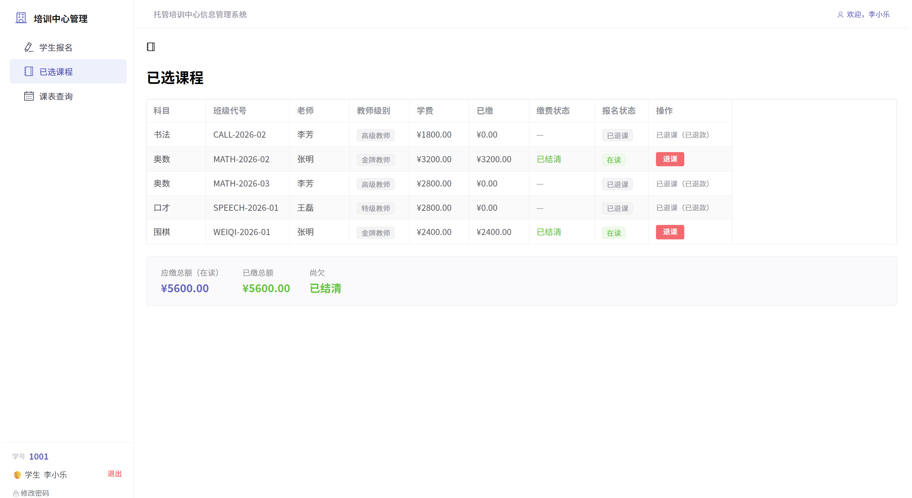
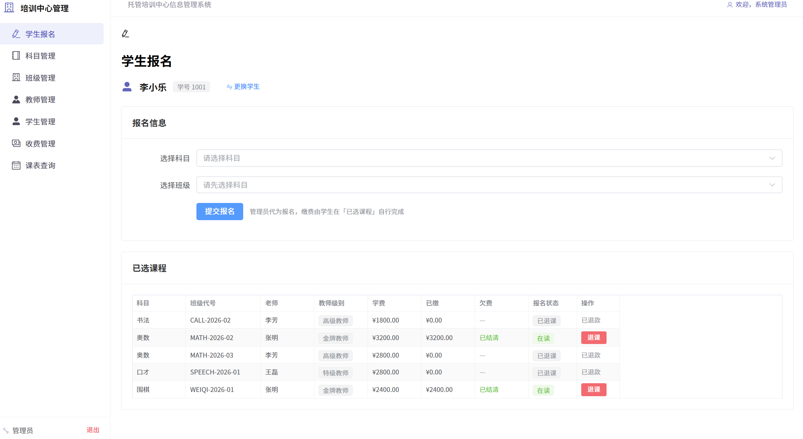
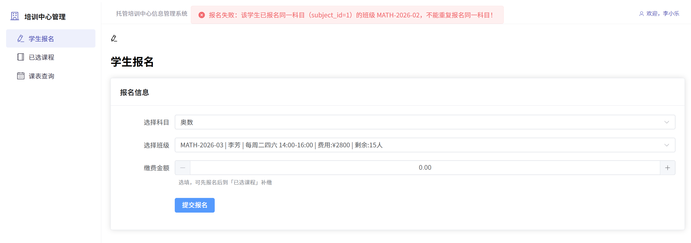

# Day08
## 2026.6.12

## 前端页面结构大改 + 后端接口补全 + Jasypt 加密 + 课设报告

今天是把前几天积累的"前端交互不舒服"的疙瘩全部理了一遍，又发现了同科目重复报名的逻辑漏洞，还硬啃了 Jasypt 加密的兼容性问题，最后把课设报告和 README 全部更新到最新状态。

---
## 一、前端页面重构与交互优化

### 1. 学生端新增“已选课程”

**学生端导航栏**由原来的 2 个增加为 3 个：**学生报名、已选课程、课表查询**

“**已选课程**”页面集中展示学生已报名课程，并支持：**查看课程信息、查看缴费状态、补缴学费、退课操作、查看费用汇总**

### 2. 学生报名页面重构

#### 学生端

**报名页面**仅保留：**选择科目、选择班级、填写缴费金额（选填）**

缴费与退课功能迁移至“已选课程”页面。

#### 管理端

报名流程调整为：

1. 查询学生
2. 查看学生信息
3. 为学生选课
4. 查看已选课程
5. 退课管理

所有操作集中在同一页面完成。



---

### 3. 课表查询页面优化

#### 学生端

自动显示个人课表。


#### 教师端

自动显示个人课表及薪酬汇总。

#### 管理端

**统一查询入口**：输入学号或工号、自动查询学生或教师课表、查询结果独立展示、支持重新查询

---

## 二、逻辑漏洞：同科目重复报名

改前端的过程中，我突然想到一个问题：现在的系统，同一个学生能不能报同一门科目的两个不同班级？

比如学生 1001 已经报了 MATH-2026-01（奥数/张明），还能不能再报 MATH-2026-02（奥数/李芳）？

Claude Code 查了 `processEnrollment` 的代码，确认了——**可以**。因为防重复只检查了 `(student_id, class_code)` 复合主键，没检查 `subject_id`。两个班级的 class_code 不一样，所以能绕过去。

这显然不合理。一个学生学两次奥数干嘛？

修复方式是在 `processEnrollment` 里插了一步：拿到新班级的 subject_id 之后，先把学生所有 active 报名都查出来，一个个比对——如果发现已有班级的 subject_id 和要报的这个一样，就拒绝。因为后面缴费校验也要用这个 activeList，所以不增加额外的数据库查询。

改完联调验证：学生 1001 已报 MATH-2026-02（奥数），再报 MATH-2026-01（也是奥数）——被拦截，提示"该学生已报名同一科目（subject_id=1）的班级 MATH-2026-02，不能重复报名同一科目！"


---

## 三、Jasypt 加密：踩坑

加分项还剩 4 项没拿，我先挑了个看起来最顺手的——**敏感数据加密**。

起因很简单：数据库密码 `Root@123456` 直接明文写在配置文件里。

Jasypt 的原理：把明文密码加密成 `ENC(一串乱码)` 的格式，Spring Boot 启动时自动解密，配置文件里就再也看不到明文了。

---

**坑一：担心版本不兼容（虚惊一场）**

jasypt 的 starter 是给Spring Boot 3+设计的，我用的是4+，心里没底。但实际引入后编译、启动都正常，算是白担心了。

**坑二：加密算法对不上（真正的坑）**

我用 Jasypt 的命令行工具生成了加密值，往配置里一填，启动直接报错——密码绑定失败。

查了一圈才发现问题：命令行工具默认用的是老算法 `PBEWithMD5AndDES`，但 starter 3.0.5 默认用的是新算法 `PBEWITHHMACSHA512ANDAES_256`，两边算法不一样，当然解不开。

**解决方法：让程序自己加密**

与其纠结工具版本，不如直接在项目里写一个临时接口 `/api/encrypt`，用和 starter 完全一致的加密器来生成密文，curl 一下拿到值，填进配置文件，问题解决。

---

最终效果：

```properties
spring.datasource.password=ENC(WIamlKL7q4495BZ0uIOYLpbjRqvdOfdutBsrTg2FjDKAenX8UK3QUHY8IxbQh5NN)
jasypt.encryptor.password=training-center-secret
```

启动正常，数据库连接正常，配置文件里再也没有明文密码了。

---

## 四、前后端全流程联调

所有代码改完之后，启动了 MySQL + 后端 Spring Boot（8080）+ 前端 Vite（5173），用 curl 跑了 19 项测试：

- 学生/教师/管理员三种登录 → 全部正确返回身份和姓名
- 按 ID 查学生、缴费总览（含 subjectName/teacherName/teacherLevel）、学生课表（仅 active）、教师课表（含薪酬）→ 数据正确
- 同科目重复报名拦截 → 生效
- 同班级重复报名拦截 → 生效
- 满员班级拦截 → 生效
- 学生总维度超额缴费拦截 → 生效
- 管理员帮学生报名（payment=0）→ 成功
- 学生自行补缴 → 成功
- 退课自动全额退款（负向冲销）→ 成功，退款 1800 元
- 教师薪酬汇总 → 5 位教师数据正确

19 项全部通过。测试数据也随手清理了。

---


## 五、明日计划

1. 晚上把今天的改动整理 commit 推送到 GitHub
2. 再把课设报告检查一遍，确认格式和内容没问题
3. 看看还有没有时间做一个 Redis 加分项
4. 最终检查：确保整个项目可以从零搭建（建库→启动后端→启动前端→完整流程）

---

## 六、项目当前状态总览

| 模块 | 完成度 | 说明 |
|------|--------|------|
| 数据库设计 | 100% | 6 张表，外键 + CHECK + 测试数据 + 迁移脚本 |
| 后端 API | 98% | 8 Controller，六重门禁校验，事务，异常，Jasypt |
| 前端页面 | 95% | 9 页面，3 角色隔离，Pinia 持久化，路由守卫 |
| 日志文档 | 100% | Day01～08 完整 |
| README | 95% | 已更新到 Day08 |
| 课设报告 | 100% | Word 文档已生成，13 张图片，7 章节 |
| 加分项 | 3/6 | 事务管理 + 全局异常处理 + Jasypt 加密 |
